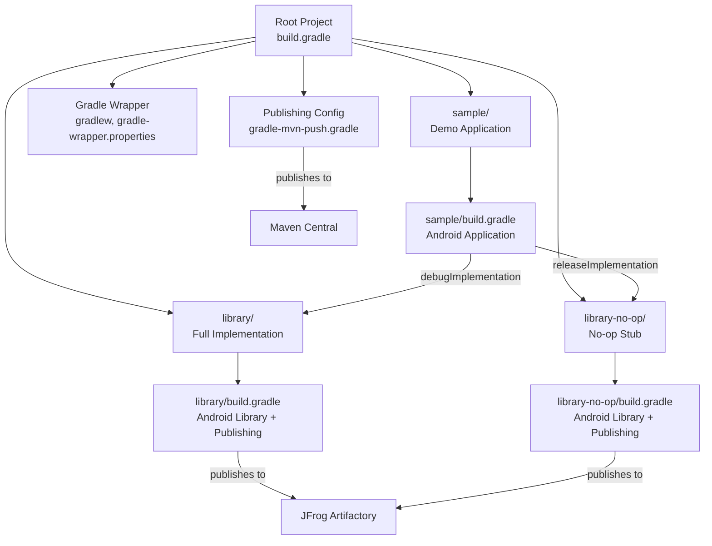
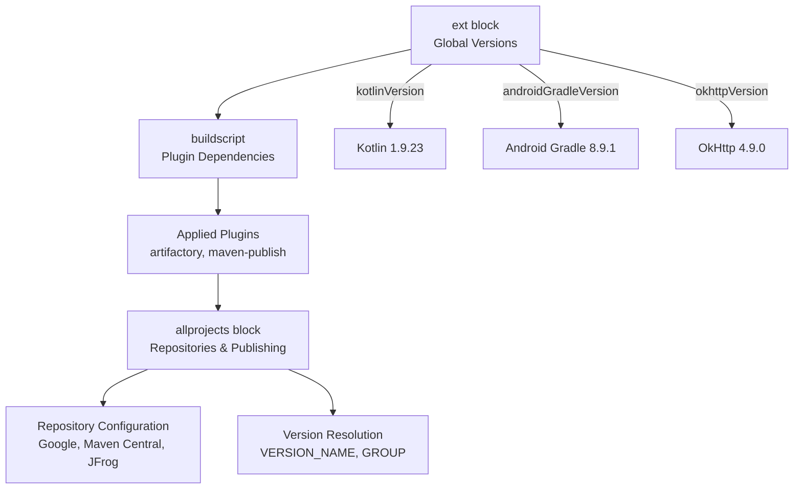
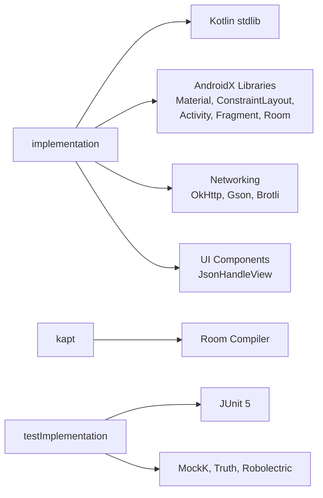
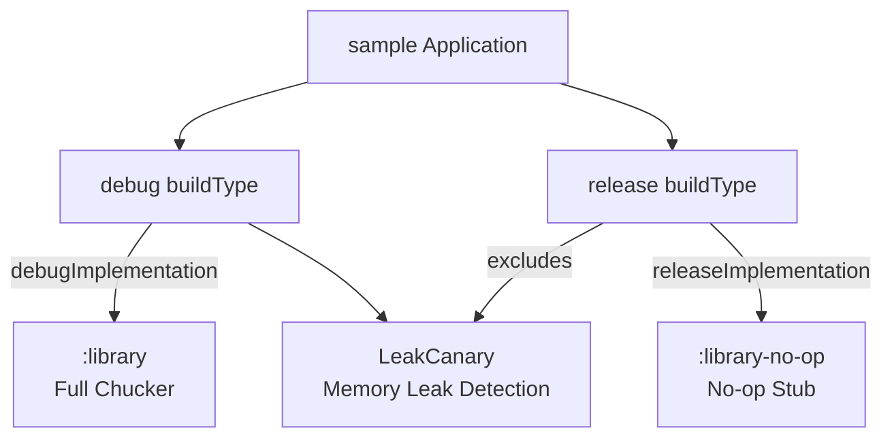
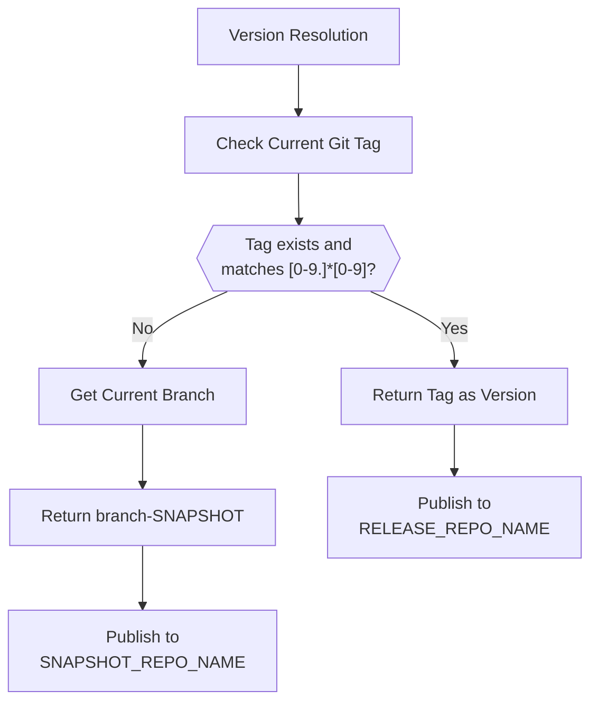
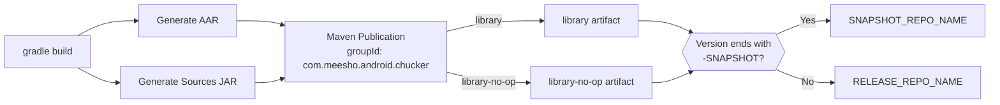
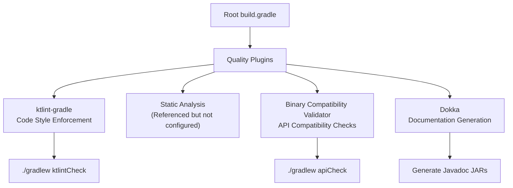

# Build System

<details>
<summary>Relevant source files</summary>

The following files were used as context for generating this wiki page:

- [.editorconfig](.editorconfig)
- [.gitattributes](.gitattributes)
- [.gitignore](.gitignore)
- [build.gradle](build.gradle)
- [gradle/gradle-mvn-push.gradle](gradle/gradle-mvn-push.gradle)
- [gradle/wrapper/gradle-wrapper.jar](gradle/wrapper/gradle-wrapper.jar)
- [gradle/wrapper/gradle-wrapper.properties](gradle/wrapper/gradle-wrapper.properties)
- [gradlew](gradlew)
- [gradlew.bat](gradlew.bat)
- [library-no-op/build.gradle](library-no-op/build.gradle)
- [library/build.gradle](library/build.gradle)
- [library/src/main/kotlin/com/chuckerteam/chucker/internal/ui/BaseChuckerActivity.kt](library/src/main/kotlin/com/chuckerteam/chucker/internal/ui/BaseChuckerActivity.kt)
- [sample/build.gradle](sample/build.gradle)
- [sample/src/main/kotlin/com/chuckerteam/chucker/sample/MainActivity.kt](sample/src/main/kotlin/com/chuckerteam/chucker/sample/MainActivity.kt)

</details>


## Purpose and Scope

This document covers the Gradle-based build system that manages the multi-module Chucker project. The build system handles dependency management, Android library compilation, artifact publishing, version resolution, and quality control integration. 

For information about the individual module structures, see [Module Structure](#3.1). For details about artifact publishing workflows, see [Publishing and Distribution](#3.3). For Gradle wrapper bootstrapping, see [Gradle Wrapper](#3.2).

## Project Structure Overview

Chucker uses a multi-module Gradle project with three primary modules implementing a dual-variant distribution strategy.

**Project Structure Diagram**


Sources: [build.gradle:1-118](), [library/build.gradle:1-157](), [library-no-op/build.gradle:1-109](), [sample/build.gradle:1-85]()

## Root Build Configuration

The root `build.gradle` file establishes the foundation for all modules through centralized configuration management.

### Global Dependencies and Versions

The build system uses extension properties to manage all dependency versions centrally:

**Dependency Categories**:
- **Android/Kotlin**: Kotlin compiler, Android Gradle Plugin, AndroidX libraries
- **Networking**: OkHttp, Retrofit, Gson, Brotli compression
- **Testing**: JUnit 5, MockK, Robolectric, Truth assertions
- **Quality Control**: Detekt, KtLint, Binary Compatibility Validator
- **Publishing**: JFrog Artifactory, Dokka documentation

**Build Configuration Hierarchy**


Sources: [build.gradle:1-62](), [build.gradle:64-99]()

### Repository Configuration

All modules inherit repository configuration from the root project:

```
repositories {
    google()
    mavenCentral()
    // JFrog Artifactory repositories for internal dependencies
    maven { url "${jfrogArtifactoryUrl}/${RELEASE_REPO_NAME}" }
    maven { url "${jfrogArtifactoryUrl}/${SNAPSHOT_REPO_NAME}" }
}
```

Sources: [build.gradle:71-92]()

### Global Settings

The root configuration establishes project-wide standards:
- **SDK Versions**: `minSdkVersion = 21`, `targetSdkVersion = 35`, `compileSdkVersion = 35`
- **Git Hooks**: Automatic pre-commit hook installation
- **Test Logging**: Standardized test event reporting across all modules

Sources: [build.gradle:112-117](), [build.gradle:101-110](), [build.gradle:94-99]()

## Module Build Configurations

Each module has specialized build configuration tailored to its purpose while inheriting common settings from the root project.

### Library Module (`library/build.gradle`)

The main library module produces the full-featured Chucker implementation:

**Key Configuration Elements**:
- **Plugin Stack**: `com.android.library`, `kotlin-android`, `kotlin-kapt`
- **Build Features**: `viewBinding = true`, `buildConfig = false`
- **Resource Prefix**: `chucker_` to prevent resource conflicts
- **ProGuard**: Consumer ProGuard rules for downstream applications

**Dependency Categories**:


Sources: [library/build.gradle:1-56](), [library/build.gradle:58-94]()

### No-Op Module (`library-no-op/build.gradle`)

The no-op module provides an empty implementation for production builds:

- **Minimal Dependencies**: Only `kotlin-stdlib` and `okhttp` as API dependency
- **No Android Resources**: No UI components or database dependencies
- **Identical API Surface**: Same public interface as full library
- **Build Config Disabled**: No generated constants

Sources: [library-no-op/build.gradle:1-46]()

### Sample Module (`sample/build.gradle`)

The sample application demonstrates Chucker integration patterns:

**Build Variant Strategy**:


**Additional Features**:
- **Wire Protocol Buffers**: `com.squareup.wire` plugin for protobuf support
- **Signing Configuration**: Debug keystore for consistent signing
- **Network Stack**: Retrofit + OkHttp + Gson for API calls

Sources: [sample/build.gradle:1-85]()

## Version Management System

Chucker implements Git-based semantic versioning with automatic snapshot generation.

**Version Resolution Algorithm**:


**Implementation Details**:
```kotlin
ext.versionName = { ->
    def currentTag = 'git tag --points-at HEAD'.execute().in.text.toString().trim()
    def currentBranch = 'git rev-parse --abbrev-ref HEAD'.execute().in.text.toString().trim()
    def tagRegex = "[0-9.]*[0-9]"
    if (!currentTag.isEmpty() && currentTag.matches(tagRegex)) {
        return currentTag
    } else {
        return currentBranch + '-SNAPSHOT'
    }
}
```

This ensures:
- **Tagged Commits**: Produce stable release versions (e.g., `4.0.0`)
- **Development Commits**: Generate snapshot versions (e.g., `develop-SNAPSHOT`)
- **Automatic Repository Selection**: Snapshots go to snapshot repo, releases to release repo

Sources: [library/build.gradle:96-105](), [library-no-op/build.gradle:48-57]()

## Publishing and Distribution

Chucker publishes to multiple repositories using different publishing strategies.

### JFrog Artifactory Publishing

Both library modules publish to JFrog Artifactory using identical configuration:

**Publishing Flow Diagram**


**Artifact Generation**:
- **AAR Files**: `$buildDir/outputs/aar/${project.getName()}-release.aar`
- **Source JARs**: Generated from `android.sourceSets.main.kotlin.srcDirs`
- **POM Generation**: Automatic dependency resolution from `releaseCompileClasspath`

Sources: [library/build.gradle:110-156](), [library-no-op/build.gradle:62-108]()

### Maven Central Publishing

The `gradle-mvn-push.gradle` script handles Maven Central publishing with additional requirements:

**Enhanced Publishing Features**:
- **Dokka Documentation**: Generated Javadoc JAR from KDoc comments
- **PGP Signing**: Artifacts signed with in-memory PGP keys
- **Repository Staging**: Separate snapshot and staging repositories
- **Rich POM Metadata**: License, SCM, and developer information

**Publishing Repositories**:
- **Snapshots**: `https://oss.sonatype.org/content/repositories/snapshots`
- **Staging**: `https://oss.sonatype.org/service/local/staging/deploy/maven2`

Sources: [gradle/gradle-mvn-push.gradle:1-119]()

## Quality Control Integration

The build system integrates multiple quality control tools through the root configuration:

**Quality Tool Stack**:


**Lint Configuration**:
Each module configures Android Lint with strict settings:
- `warningsAsErrors = true`
- `abortOnError = true`  
- Specific rule exemptions (RTL support, dependency updates)

Sources: [build.gradle:27-32](), [build.gradle:54-60](), [library/build.gradle:32-39]()

## Development Workflow Integration

The build system supports common development workflows through task automation:

**Git Hook Installation**:
```gradle
task installGitHook(type: Copy) {
    from new File(rootProject.rootDir, 'pre-commit')
    into { new File(rootProject.rootDir, '.git/hooks') }
    fileMode 0777
}
```

**Test Configuration**:
- **JUnit 5 Platform**: Modern testing framework with parameterized tests
- **Android Resources**: `includeAndroidResources = true` for Robolectric tests
- **Test Logging**: Standardized event reporting across all test tasks

Sources: [build.gradle:101-110](), [library/build.gradle:41-48]()

This build system architecture enables Chucker to maintain high code quality while supporting flexible deployment strategies for both development and production environments.
