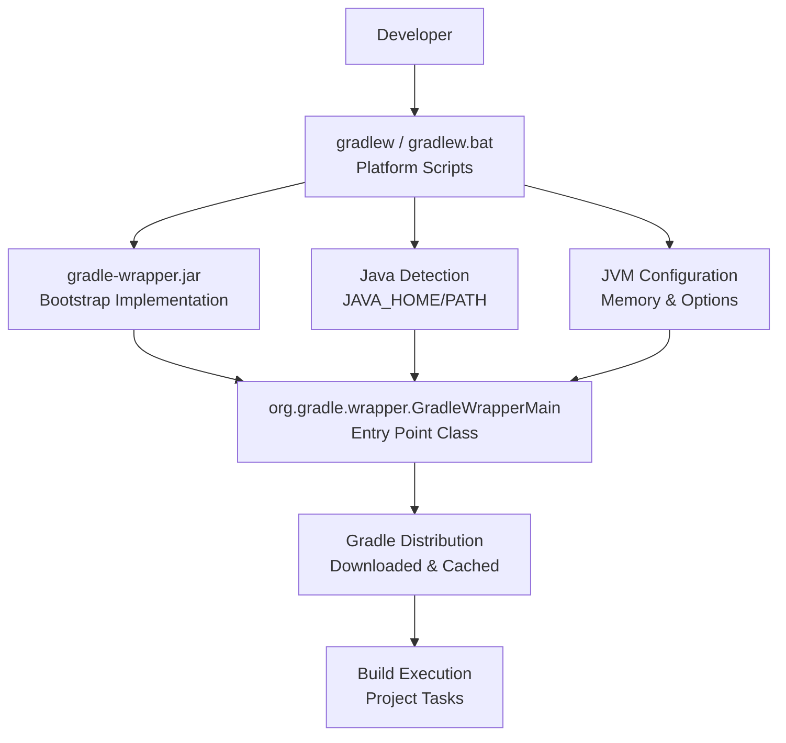
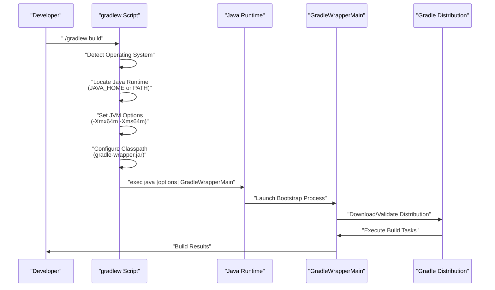
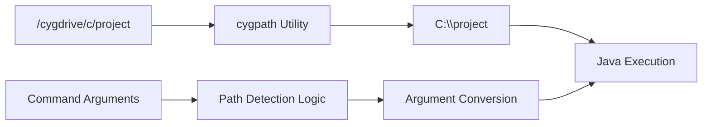
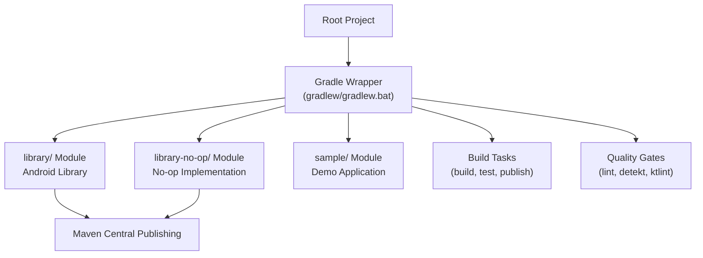

# Gradle Wrapper

<details>
<summary>Relevant source files</summary>

The following files were used as context for generating this wiki page:

- [.editorconfig](.editorconfig)
- [.gitattributes](.gitattributes)
- [.gitignore](.gitignore)
- [gradle/wrapper/gradle-wrapper.jar](gradle/wrapper/gradle-wrapper.jar)
- [gradlew](gradlew)
- [gradlew.bat](gradlew.bat)

</details>


## Purpose and Scope

This document covers the Gradle Wrapper system in the Chucker codebase, which provides a standardized way to bootstrap and execute Gradle builds without requiring users to pre-install Gradle. The wrapper ensures consistent Gradle versions across development environments and CI/CD systems. For information about the overall build configuration and module structure, see [Module Structure](#3.1). For details about artifact publishing processes, see [Publishing and Distribution](#3.3).

## Wrapper Components

The Gradle Wrapper consists of three main components that work together to bootstrap the build environment:



### Platform-Specific Scripts

The wrapper provides platform-specific entry points that handle environment detection and Java execution:

| Component | Platform | Purpose |
|-----------|----------|---------|
| `gradlew` | Unix/Linux/macOS | POSIX-compliant shell script with cross-platform compatibility |
| `gradlew.bat` | Windows | Batch script with Windows-specific path handling |
| `gradle/wrapper/gradle-wrapper.jar` | All platforms | Java bootstrap implementation containing wrapper logic |

## Script Execution Flow

The wrapper scripts follow a standardized execution pattern to ensure consistent behavior across platforms:



## Java Runtime Detection

Both wrapper scripts implement robust Java detection logic to locate a suitable runtime environment:

### Unix Script (`gradlew`)

The Unix script [gradlew:121-140]() implements the following detection strategy:

1. **JAVA_HOME Priority**: If `JAVA_HOME` is set, validate and use the Java executable
   - IBM JDK detection for AIX: `$JAVA_HOME/jre/sh/java`
   - Standard path: `$JAVA_HOME/bin/java`
2. **PATH Fallback**: Use system `java` command if `JAVA_HOME` is not set
3. **Validation**: Verify executable exists and is runnable

### Windows Script (`gradlew.bat`)

The Windows script [gradlew.bat:38-66]() follows similar logic:

1. **JAVA_HOME Detection**: Check for valid `JAVA_HOME` environment variable
2. **PATH Resolution**: Fallback to `java.exe` in system PATH
3. **Error Handling**: Provide clear error messages for missing Java installations

## JVM Configuration

Both scripts configure consistent JVM memory settings optimized for the build process:

| Setting | Value | Purpose |
|---------|-------|---------|
| `-Xmx64m` | Maximum heap size | Limit memory usage for wrapper bootstrap |
| `-Xms64m` | Initial heap size | Consistent startup memory allocation |

These settings are defined in [gradlew:89]() and [gradlew.bat:36]() as `DEFAULT_JVM_OPTS`.

Sources: [gradlew:88-90](), [gradlew.bat:35-36]()

## Platform-Specific Adaptations

The wrapper scripts include platform-specific logic to handle environment variations:

### Unix Environments

The Unix script [gradlew:105-115]() detects and adapts to:

- **Cygwin**: Windows POSIX layer with Unix-style paths
- **Darwin**: macOS-specific behaviors  
- **MSYS/MinGW**: Windows development environments
- **NonStop**: HPE NonStop platform support

### Path Handling

For Windows environments (Cygwin/MSYS), the script [gradlew:165-194]() performs path conversion:



## Classpath and Bootstrap Process

The wrapper establishes a minimal classpath pointing to the bootstrap JAR:

1. **Classpath Setup**: [gradlew:117]() and [gradlew.bat:70]() set `CLASSPATH=$APP_HOME/gradle/wrapper/gradle-wrapper.jar`
2. **Main Class**: Both scripts invoke `org.gradle.wrapper.GradleWrapperMain` as the entry point
3. **Argument Passing**: All command-line arguments are forwarded to the wrapper main class

### Final Execution Command

The scripts construct and execute the final Java command [gradlew:202-206]():

```bash
java -Dorg.gradle.appname=gradlew \
     -classpath gradle/wrapper/gradle-wrapper.jar \
     org.gradle.wrapper.GradleWrapperMain \
     "$@"
```

## Integration with Build System

The Gradle Wrapper integrates seamlessly with the overall build system architecture:



## File Structure

The wrapper maintains a standardized file structure within the project:

| File Path | Purpose | Platform |
|-----------|---------|----------|
| `gradlew` | Unix execution script | Unix/Linux/macOS |
| `gradlew.bat` | Windows execution script | Windows |
| `gradle/wrapper/gradle-wrapper.jar` | Bootstrap implementation | All |
| `gradle/wrapper/gradle-wrapper.properties` | Wrapper configuration | All |

The wrapper JAR [gradle/wrapper/gradle-wrapper.jar]() contains the complete bootstrap implementation including classes like:

- `org.gradle.wrapper.GradleWrapperMain` - Primary entry point
- `org.gradle.wrapper.Download` - Distribution download logic
- `org.gradle.wrapper.Install` - Installation management
- `org.gradle.wrapper.PathAssembler` - Path resolution utilities

Sources: [gradlew](), [gradlew.bat](), [gradle/wrapper/gradle-wrapper.jar](), [.gitignore:3-4](), [.gitattributes:3-4]()
