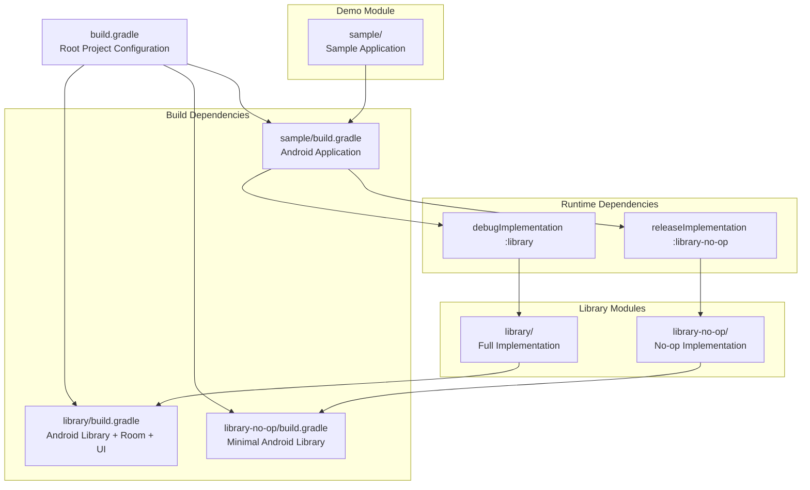
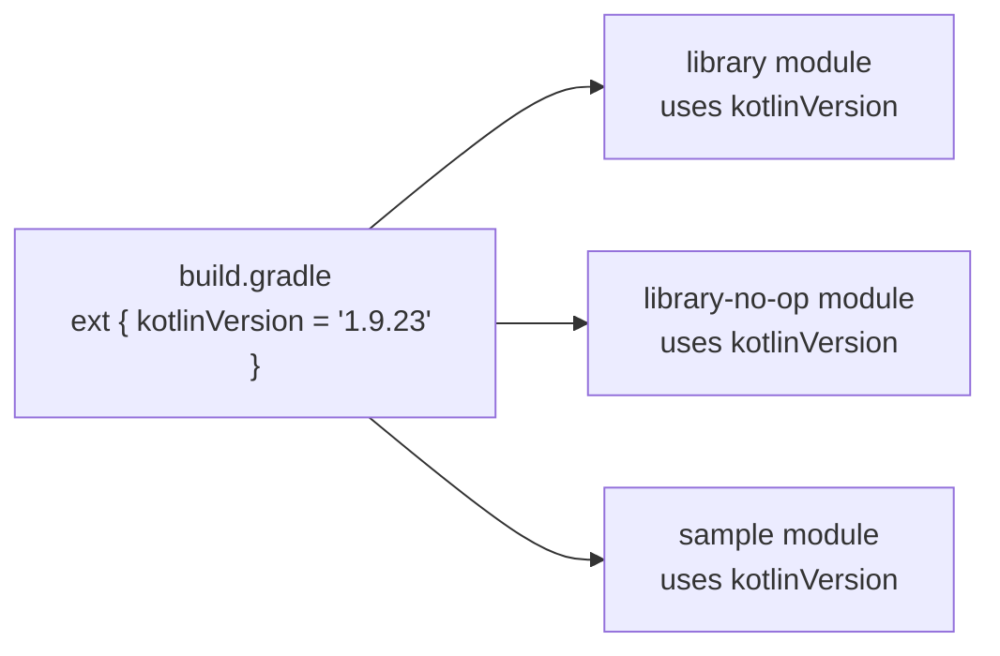
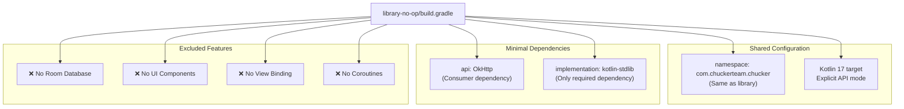
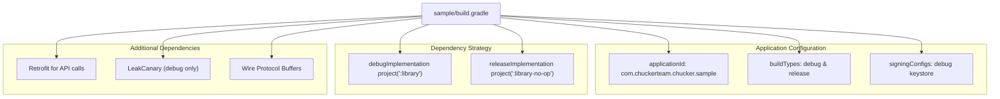
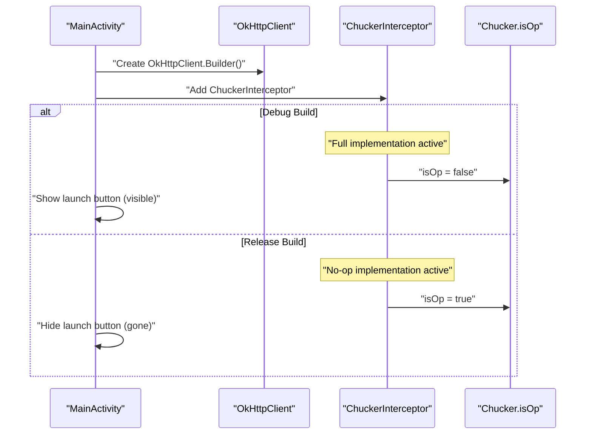
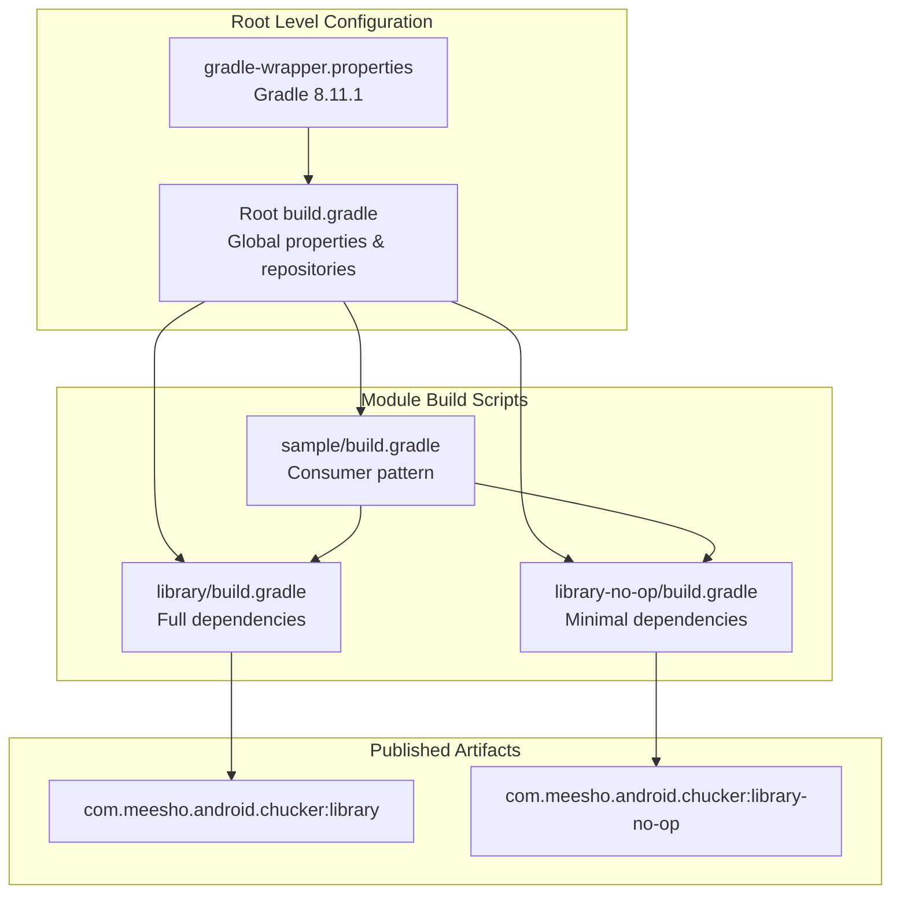

# Module Structure

Relevant source files

The following files were used as context for generating this wiki page:

- [build.gradle](build.gradle)
- [gradle/wrapper/gradle-wrapper.properties](gradle/wrapper/gradle-wrapper.properties)
- [library-no-op/build.gradle](library-no-op/build.gradle)
- [library/build.gradle](library/build.gradle)
- [library/src/main/kotlin/com/chuckerteam/chucker/internal/ui/BaseChuckerActivity.kt](library/src/main/kotlin/com/chuckerteam/chucker/internal/ui/BaseChuckerActivity.kt)
- [sample/build.gradle](sample/build.gradle)
- [sample/src/main/kotlin/com/chuckerteam/chucker/sample/MainActivity.kt](sample/src/main/kotlin/com/chuckerteam/chucker/sample/MainActivity.kt)

This document explains the multi-module Gradle project structure of Chucker, including the three core modules and their interdependencies. The module structure enables Chucker's dual-variant distribution strategy, where developers get full HTTP inspection capabilities in debug builds while production builds automatically use lightweight no-op implementations.

For information about the Gradle wrapper bootstrapping process, see [Gradle Wrapper](#3.2). For details on artifact publishing and Maven distribution, see [Publishing and Distribution](#3.3).

## Project Structure Overview

Chucker is organized as a multi-module Gradle project with a root project coordinating three specialized modules. The architecture supports both development-time HTTP inspection and production safety through build variant switching.

### Module Dependency Diagram

Sources: [build.gradle:1-118](), [library/build.gradle:1-157](), [library-no-op/build.gradle:1-109](), [sample/build.gradle:1-85]()

## Root Project Configuration

The root `build.gradle` establishes the foundation for all modules through global configuration and shared dependencies. It defines build tool versions, common repositories, and publishing infrastructure.

### Key Configuration Elements

| Configuration Area | Purpose | Implementation |
|-------------------|---------|---------------|
| Build Tools | Gradle plugin versions and dependencies | Android Gradle Plugin 8.9.1, Kotlin 1.9.23 |
| Global Properties | Shared version constants and SDK levels | `minSdkVersion = 21`, `targetSdkVersion = 35` |
| Repository Setup | Maven and JFrog Artifactory configuration | Google, Maven Central, custom Artifactory repos |
| Publishing Framework | Maven publication and Artifactory integration | Applied to all subprojects via `allprojects` block |

### Version Management Strategy

The root project centralizes version management through extension properties, ensuring consistency across all modules:

Sources: [build.gradle:1-44](), [build.gradle:64-99](), [build.gradle:112-117]()

## Library Module (Full Implementation)

The `library` module contains the complete Chucker implementation with HTTP interception, data persistence, and user interface components. This module is used in debug builds to provide full HTTP inspection capabilities.

### Module Configuration

The library module configuration emphasizes developer experience and comprehensive functionality:

```mermaid
graph TB
    LIB_CONFIG["library/build.gradle"]
    
    subgraph "Android Configuration"
        NAMESPACE["namespace: com.chuckerteam.chucker"]
        VIEW_BINDING["viewBinding: true"]
        RESOURCE_PREFIX["resourcePrefix: chucker_"]
    end
    
    subgraph "Core Dependencies"
        KOTLIN["kotlin-stdlib"]
        MATERIAL["Material Components"]
        ROOM["Room Database + KTX"]
        COROUTINES["Kotlin Coroutines"]
    end
    
    subgraph "Networking Dependencies"
        OKHTTP["OkHttp"]
        GSON["Gson JSON"]
        BROTLI["Brotli Decompression"]
    end
    
    subgraph "UI Dependencies"
        FRAGMENTS["Fragment KTX"]
        LIFECYCLE["Lifecycle Components"]
        CONSTRAINT["ConstraintLayout"]
    end
    
    LIB_CONFIG --> NAMESPACE
    LIB_CONFIG --> VIEW_BINDING
    LIB_CONFIG --> RESOURCE_PREFIX
    
    LIB_CONFIG --> KOTLIN
    LIB_CONFIG --> MATERIAL
    LIB_CONFIG --> ROOM
    LIB_CONFIG --> COROUTINES
    
    LIB_CONFIG --> OKHTTP
    LIB_CONFIG --> GSON
    LIB_CONFIG --> BROTLI
    
    LIB_CONFIG --> FRAGMENTS
    LIB_CONFIG --> LIFECYCLE
    LIB_CONFIG --> CONSTRAINT
```

### Publishing Configuration

The library module publishes to Maven repositories with comprehensive artifact generation:

| Artifact Type | Purpose | Configuration |
|--------------|---------|---------------|
| AAR File | Primary Android library archive | `${buildDir}/outputs/aar/${project.getName()}-release.aar` |
| Sources JAR | Source code for IDE integration | `androidSourcesJar` task with Kotlin source directories |
| POM Dependencies | Resolved dependency tree | Auto-generated from `releaseCompileClasspath` |

Sources: [library/build.gradle:5-56](), [library/build.gradle:58-94](), [library/build.gradle:110-157]()

## Library-No-Op Module (Production Implementation)

The `library-no-op` module provides stub implementations of the Chucker API with minimal overhead for production builds. This module maintains API compatibility while eliminating debugging functionality and UI dependencies.

### Minimal Configuration Strategy

### API Compatibility

The no-op module maintains the same namespace (`com.chuckerteam.chucker`) as the full library, ensuring that consuming applications can switch between variants without code changes. The `api` dependency on OkHttp ensures that consumers receive the necessary OkHttp types.

Sources: [library-no-op/build.gradle:4-41](), [library-no-op/build.gradle:43-46](), [library-no-op/build.gradle:59-109]()

## Sample Module (Demonstration Application)

The sample module demonstrates Chucker integration patterns and serves as a testing ground for library functionality. It showcases the dual-variant dependency strategy that consuming applications should adopt.

### Build Configuration

The sample application configuration demonstrates best practices for Chucker integration:

### Runtime Integration Pattern

The sample application demonstrates how to integrate Chucker in consuming applications:

The sample uses `Chucker.isOp` to conditionally display UI elements that only work with the full implementation, as shown in [sample/src/main/kotlin/com/chuckerteam/chucker/sample/MainActivity.kt:42]().

Sources: [sample/build.gradle:9-67](), [sample/build.gradle:69-84](), [sample/src/main/kotlin/com/chuckerteam/chucker/sample/MainActivity.kt:26-79]()

## Module Interdependency Resolution

The build system coordinates complex interdependencies between modules while maintaining clean separation of concerns. The root project orchestrates shared configuration while individual modules define their specific requirements.

### Dependency Resolution Flow

### Version Coordination Strategy

Both library modules implement identical version resolution logic using Git-based version detection. This ensures that paired artifacts (library and library-no-op) always have matching versions:

| Version Detection Method | Implementation | Result |
|-------------------------|---------------|---------|
| Git Tag Detection | `git tag --points-at HEAD` | Use tag as version (e.g., "8.0") |
| Branch Detection | `git rev-parse --abbrev-ref HEAD` | Use branch + "-SNAPSHOT" suffix |
| Repository Publishing | JFrog Artifactory routing | SNAPSHOT vs RELEASE repository selection |

Sources: [gradle/wrapper/gradle-wrapper.properties:1-7](), [library/build.gradle:96-105](), [library-no-op/build.gradle:48-57]()
