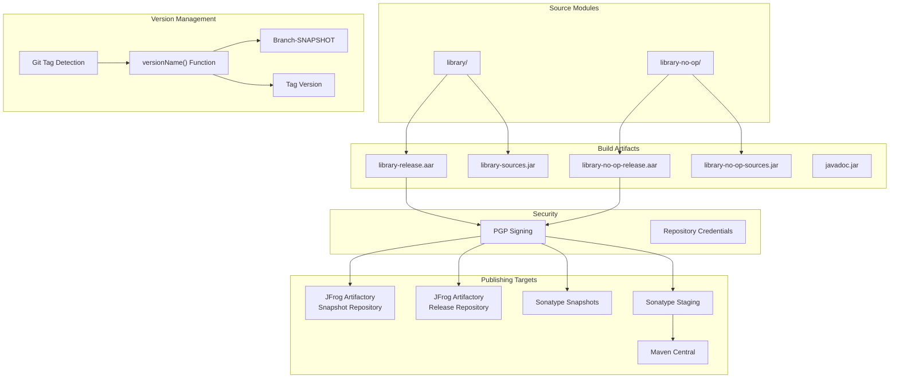
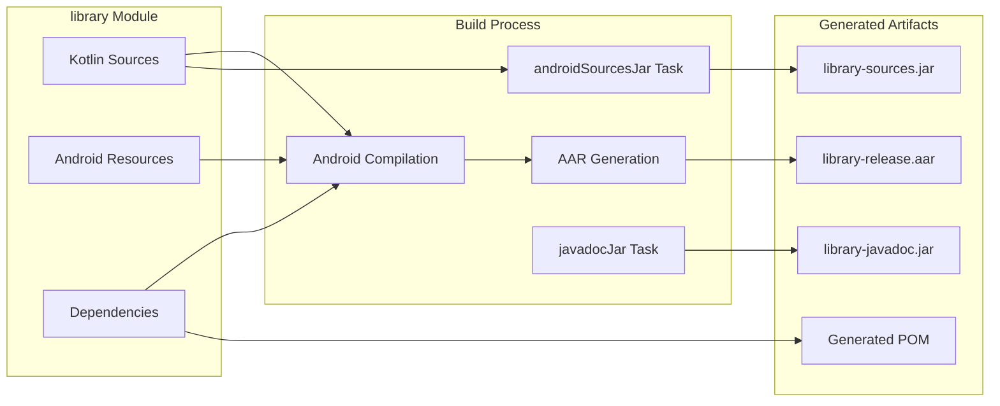
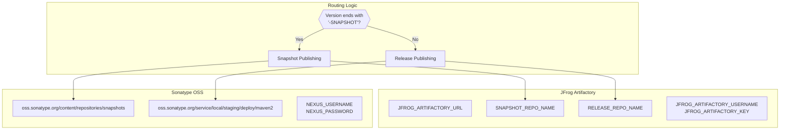
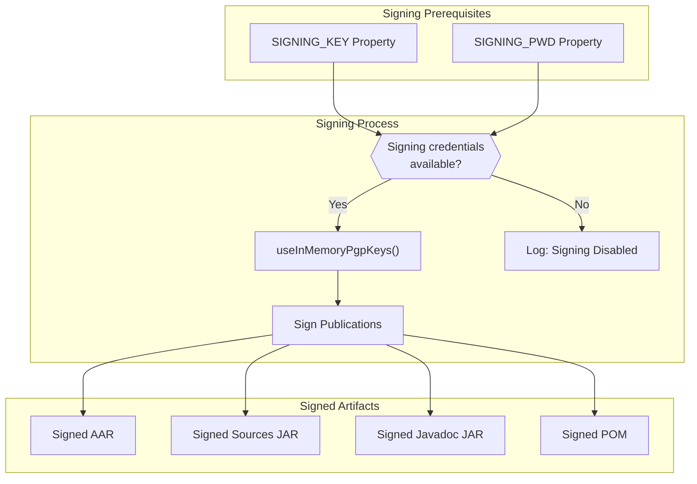
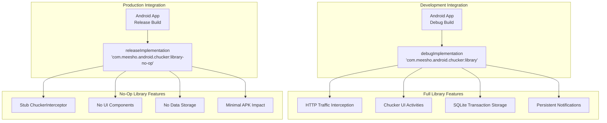

# Publishing and Distribution

<details>
<summary>Relevant source files</summary>

The following files were used as context for generating this wiki page:

- [build.gradle](build.gradle)
- [gradle/gradle-mvn-push.gradle](gradle/gradle-mvn-push.gradle)
- [gradle/wrapper/gradle-wrapper.properties](gradle/wrapper/gradle-wrapper.properties)
- [library-no-op/build.gradle](library-no-op/build.gradle)
- [library/build.gradle](library/build.gradle)
- [library/src/main/kotlin/com/chuckerteam/chucker/internal/ui/BaseChuckerActivity.kt](library/src/main/kotlin/com/chuckerteam/chucker/internal/ui/BaseChuckerActivity.kt)
- [sample/build.gradle](sample/build.gradle)
- [sample/src/main/kotlin/com/chuckerteam/chucker/sample/MainActivity.kt](sample/src/main/kotlin/com/chuckerteam/chucker/sample/MainActivity.kt)

</details>


This document covers how Chucker library artifacts are built, versioned, signed, and published to Maven repositories. It details the dual distribution strategy, version management, and the publishing pipeline that makes Chucker available to Android developers through Maven Central and JFrog Artifactory.

For information about the module structure and build configuration, see [Module Structure](#3.1). For details about the Gradle wrapper that bootstraps the build environment, see [Gradle Wrapper](#3.2).

## Overview

Chucker uses a sophisticated publishing strategy that distributes two distinct artifacts:
- `com.meesho.android.chucker:library` - Full HTTP inspection functionality
- `com.meesho.android.chucker:library-no-op` - No-op stub for production builds

Both artifacts are published to multiple Maven repositories with proper PGP signing for security and authenticity.

### Publishing Architecture



Sources: [build.gradle:64-99](), [library/build.gradle:115-156](), [library-no-op/build.gradle:67-108](), [gradle/gradle-mvn-push.gradle:42-118]()

## Version Management

Chucker uses a Git-based versioning strategy implemented in the `versionName()` function within both library modules.

### Versioning Logic

| Condition | Version Format | Example |
|-----------|---------------|---------|
| Tagged commit matching `[0-9.]*[0-9]` | Tag name | `4.0.0` |
| Untagged commit | `{branch}-SNAPSHOT` | `develop-SNAPSHOT` |

The version detection logic:

```kotlin
ext.versionName = { ->
    def currentTag = 'git tag --points-at HEAD'.execute().in.text.toString().trim()
    def currentBranch = 'git rev-parse --abbrev-ref HEAD'.execute().in.text.toString().trim()
    def tagRegex = "[0-9.]*[0-9]"
    if (!currentTag.isEmpty() && currentTag.matches(tagRegex)) {
        return currentTag
    } else {
        return currentBranch + '-SNAPSHOT'
    }
}
```

Sources: [library/build.gradle:96-105](), [library-no-op/build.gradle:48-57]()

## Artifact Generation

Both library modules generate standardized Maven artifacts including AAR files, source JARs, and Javadoc.

### Library Module Artifacts



The `androidSourcesJar` task packages source files:

```gradle
task androidSourcesJar(type: Jar) {
    archiveClassifier.set('sources')
    from android.sourceSets.main.kotlin.srcDirs
}
```

Sources: [library/build.gradle:110-113](), [library-no-op/build.gradle:62-65](), [gradle/gradle-mvn-push.gradle:31-34]()

## Publishing Targets

Chucker publishes to multiple Maven repositories depending on the artifact version and target environment.

### Repository Configuration



### JFrog Artifactory Configuration

The artifactory plugin configuration determines repository routing:

```gradle
artifactory {
    contextUrl = project.properties["JFROG_ARTIFACTORY_URL"]
    publish {
        repository {
            repoKey = libraryVersion.endsWith('-SNAPSHOT') ? 
                project.properties["SNAPSHOT_REPO_NAME"] :
                project.properties["RELEASE_REPO_NAME"]
            username = project.properties["JFROG_ARTIFACTORY_USERNAME"]
            password = project.properties["JFROG_ARTIFACTORY_KEY"]
        }
    }
}
```

Sources: [library/build.gradle:138-156](), [library-no-op/build.gradle:90-108](), [gradle/gradle-mvn-push.gradle:43-60]()

## Maven Publication Configuration

Each library module defines Maven publication details including group ID, artifact ID, and POM generation.

### Publication Definition

| Module | Group ID | Artifact ID | Publication Name |
|--------|----------|-------------|------------------|
| library | `com.meesho.android.chucker` | `library` | `aar` |
| library-no-op | `com.meesho.android.chucker` | `library-no-op` | `aar` |

### POM Generation

Both modules generate POM files with dependency information:

```gradle
pom.withXml {
    def dependencies = asNode().appendNode('dependencies')
    configurations.getByName("releaseCompileClasspath")
        .getResolvedConfiguration()
        .getFirstLevelModuleDependencies().each {
        def dependency = dependencies.appendNode('dependency')
        dependency.appendNode('groupId', it.moduleGroup)
        dependency.appendNode('artifactId', it.moduleName)
        dependency.appendNode('version', it.moduleVersion)
    }
}
```

Sources: [library/build.gradle:116-137](), [library-no-op/build.gradle:68-89]()

## PGP Signing and Security

Maven Central releases require PGP signing for authenticity. The `gradle-mvn-push.gradle` script handles signing configuration.

### Signing Configuration



The signing logic conditionally applies PGP signing:

```gradle
def signingKey = findProperty("SIGNING_KEY")
def signingPwd = findProperty("SIGNING_PWD")
if (signingKey && signingPwd) {
    signing {
        useInMemoryPgpKeys(signingKey, signingPwd)
        sign publishing.publications.release
    }
} else {
    logger.info("Signing Disable as the PGP key was not found")
}
```

Sources: [gradle/gradle-mvn-push.gradle:108-118]()

## Dual Distribution Strategy

Chucker's key architectural decision is publishing two variants: a full-featured library and a no-op stub for production builds.

### Distribution Comparison



### Sample App Configuration

The sample application demonstrates this dual dependency approach:

```gradle
dependencies {
    debugImplementation project(':library')
    releaseImplementation project(':library-no-op')
    // ... other dependencies
}
```

This ensures that:
- Debug builds include full Chucker functionality for development
- Release builds use the no-op implementation with minimal overhead
- Same API surface across both variants maintains compatibility

Sources: [sample/build.gradle:70-71](), [library/build.gradle:1-56](), [library-no-op/build.gradle:1-46]()
