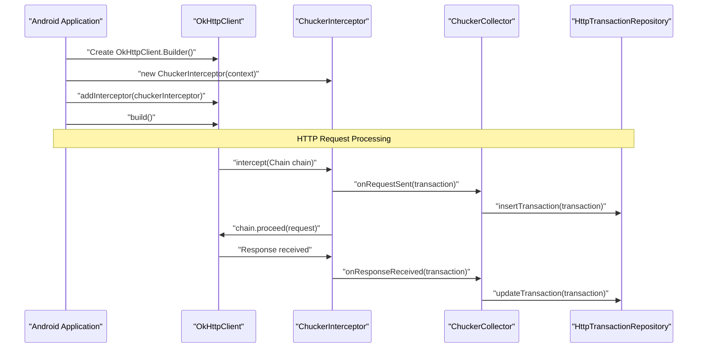
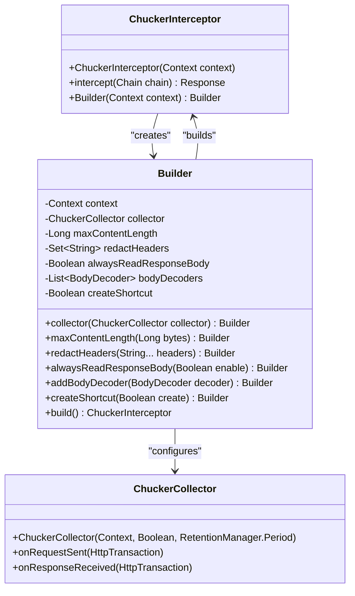
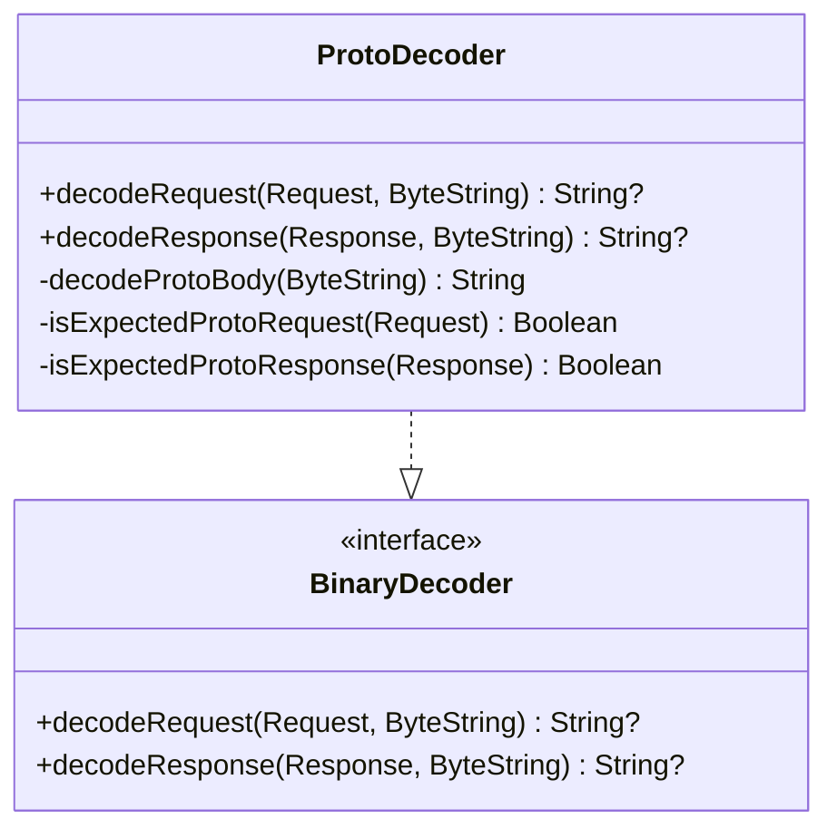
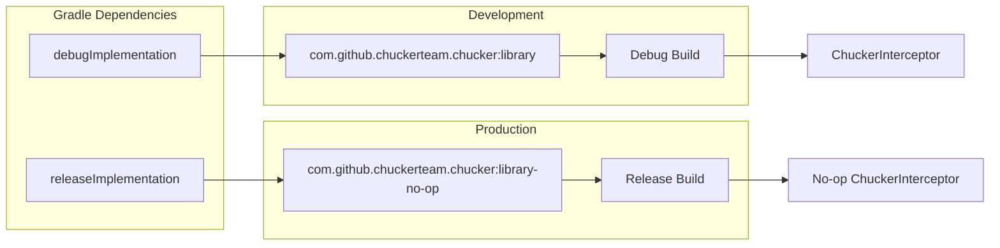
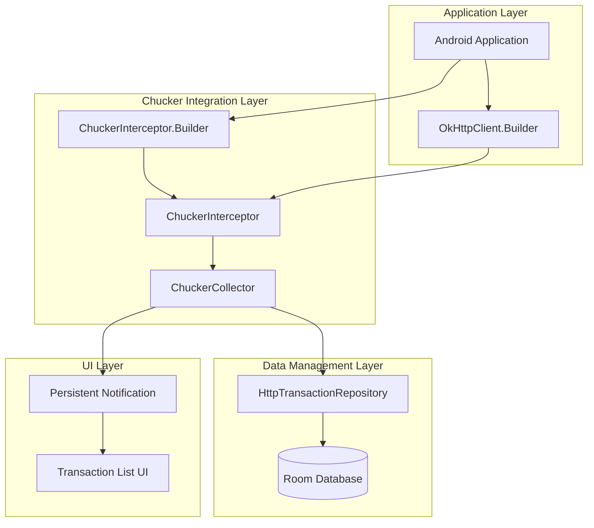

# ChuckerInterceptor

<details>
<summary>Relevant source files</summary>

The following files were used as context for generating this wiki page:

- [CHANGELOG.md](CHANGELOG.md)
- [README.md](README.md)
- [gradle.properties](gradle.properties)

</details>


This document covers the `ChuckerInterceptor` class, which serves as the primary integration point between Chucker and OkHttp clients. The interceptor captures HTTP requests and responses, forwarding them to the data collection system for storage and UI display.

For information about the underlying data management and repository layer, see [Data Management](#4.2). For details about the UI components that display captured transactions, see [User Interface](#5).

## Purpose and Integration

`ChuckerInterceptor` implements the OkHttp interceptor pattern to transparently capture HTTP traffic from any OkHttp client. It acts as the bridge between your application's network layer and Chucker's inspection capabilities, requiring minimal setup while providing extensive configuration options.

### Basic Integration Flow



Sources: [README.md:45-51](), [README.md:124-127]()

## Simple Integration

The most basic integration requires only a context parameter and adding the interceptor to your OkHttp client:

```kotlin
val client = OkHttpClient.Builder()
                .addInterceptor(ChuckerInterceptor(context))
                .build()
```

This approach uses default settings suitable for most development scenarios, including automatic notification display and standard data retention policies.

Sources: [README.md:47-50]()

## Advanced Configuration with Builder Pattern

Since version 3.4.0, `ChuckerInterceptor` supports a builder pattern for comprehensive configuration. The parameterized constructor is deprecated in favor of this approach:

### ChuckerInterceptor Builder Architecture



Sources: [README.md:106-122](), [CHANGELOG.md:61](), [CHANGELOG.md:79]()

### Complete Configuration Example

The builder pattern enables comprehensive customization of interceptor behavior:

```kotlin
// Create the Collector
val chuckerCollector = ChuckerCollector(
        context = this,
        showNotification = true,
        retentionPeriod = RetentionManager.Period.ONE_HOUR
)

// Create the Interceptor
val chuckerInterceptor = ChuckerInterceptor.Builder(context)
        .collector(chuckerCollector)
        .maxContentLength(250_000L)
        .redactHeaders("Auth-Token", "Bearer")
        .alwaysReadResponseBody(true)
        .addBodyDecoder(decoder)
        .createShortcut(true)
        .build()
```

Sources: [README.md:96-122]()

## Configuration Options

### Data Collection and Storage

| Configuration Method | Purpose | Default Behavior |
|---------------------|---------|------------------|
| `collector(ChuckerCollector)` | Custom collector instance | Uses default collector with context |
| `maxContentLength(Long)` | Response body size limit in bytes | Unlimited |
| `alwaysReadResponseBody(Boolean)` | Read full response even if client doesn't consume | `false` |

### Security and Privacy

| Configuration Method | Purpose | Security Impact |
|---------------------|---------|-----------------|
| `redactHeaders(String...)` | Hide sensitive headers with `**` | Headers visible by default |
| `redactHeader(String)` | Single header redaction | Individual header control |

**Warning**: The interceptor captures sensitive information including authorization headers and request/response bodies. It should only be used in debug builds.

Sources: [README.md:108-116](), [README.md:132-141]()

### Body Processing and Decoding

The interceptor supports custom body decoders for non-standard formats:

#### Custom Decoder Implementation



Sources: [README.md:147-164](), [CHANGELOG.md:9]()

### Android Integration Features

| Feature | Configuration | Availability |
|---------|---------------|--------------|
| Dynamic Shortcuts | `createShortcut(Boolean)` | SNAPSHOT versions |
| Notification Display | Via `ChuckerCollector` | All versions |
| Multi-Window Support | Automatic | Android 7.x+ |

Sources: [README.md:120-121](), [CHANGELOG.md:10]()

## Distribution Strategy

Chucker follows a dual-artifact strategy to ensure production safety:

### Build Variant Integration



### Dependency Declaration

```groovy
dependencies {
  debugImplementation "com.github.chuckerteam.chucker:library:3.5.2"
  releaseImplementation "com.github.chuckerteam.chucker:library-no-op:3.5.2"
}
```

The no-op variant provides identical API surface but with empty implementations, ensuring zero runtime overhead in production builds.

Sources: [README.md:36-42](), [README.md:80]()

## Version Compatibility and Requirements

### Platform Requirements

| Requirement | Version | Notes |
|-------------|---------|--------|
| Android API | 21+ | Version 4.x requirement |
| OkHttp | 4.x | Compatible with latest OkHttp |
| Java | 8+ | Language features requirement |

### Java 8 Support Configuration

```groovy
android {
  compileOptions {
    sourceCompatibility JavaVersion.VERSION_1_8
    targetCompatibility JavaVersion.VERSION_1_8
  }
  kotlinOptions.jvmTarget = "1.8"
}
```

Sources: [README.md:53-64](), [README.md:76-77](), [CHANGELOG.md:212-214]()

## Architecture Integration Points

### System Integration Overview



The interceptor serves as the entry point into Chucker's ecosystem, bridging the gap between standard OkHttp usage and comprehensive HTTP inspection capabilities.

Sources: [README.md:24-26](), [README.md:93-127]()
