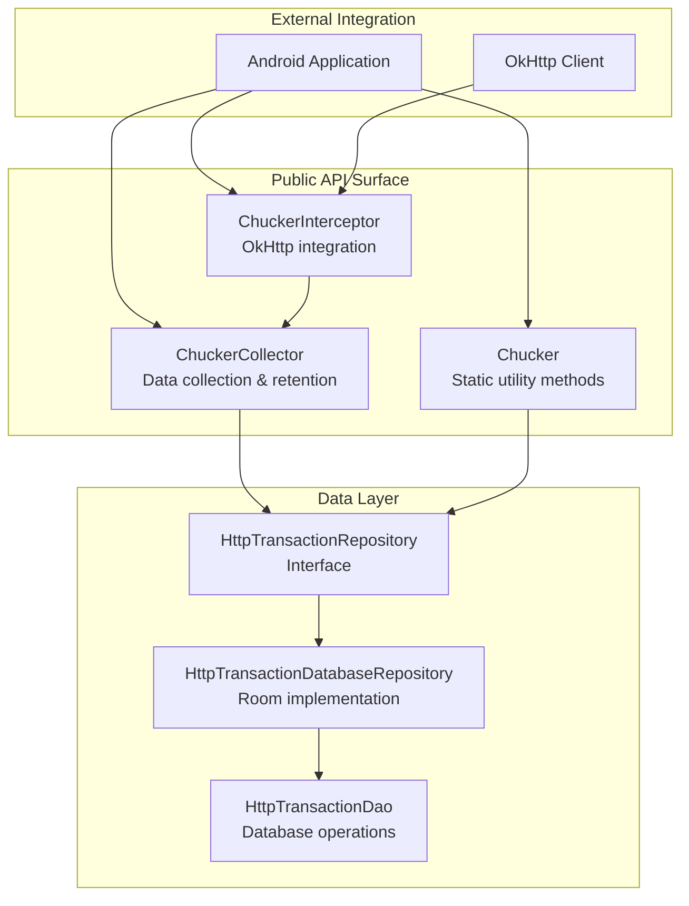
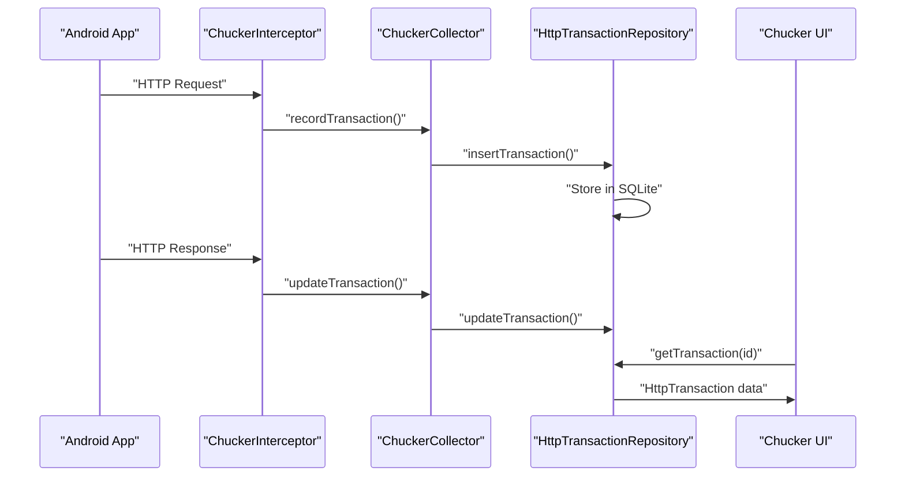
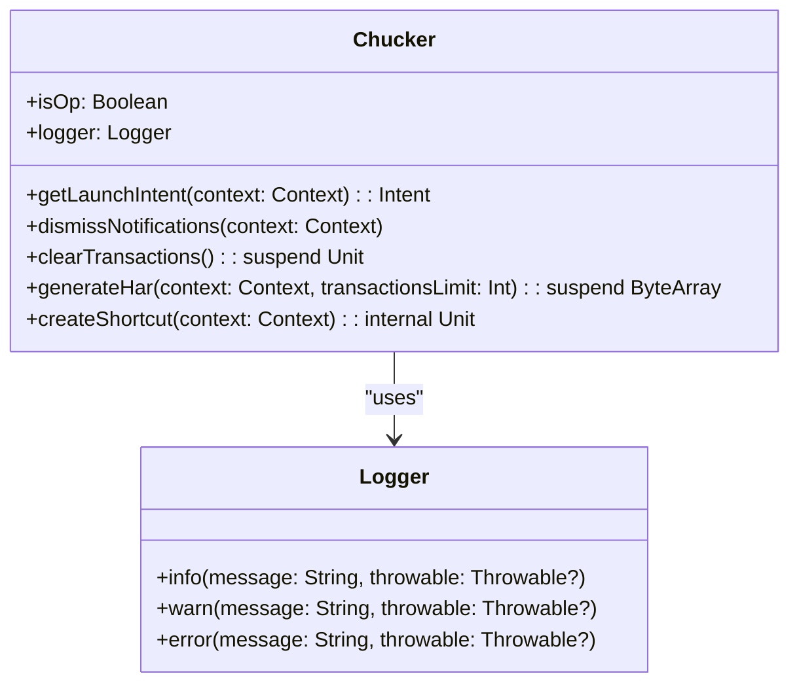
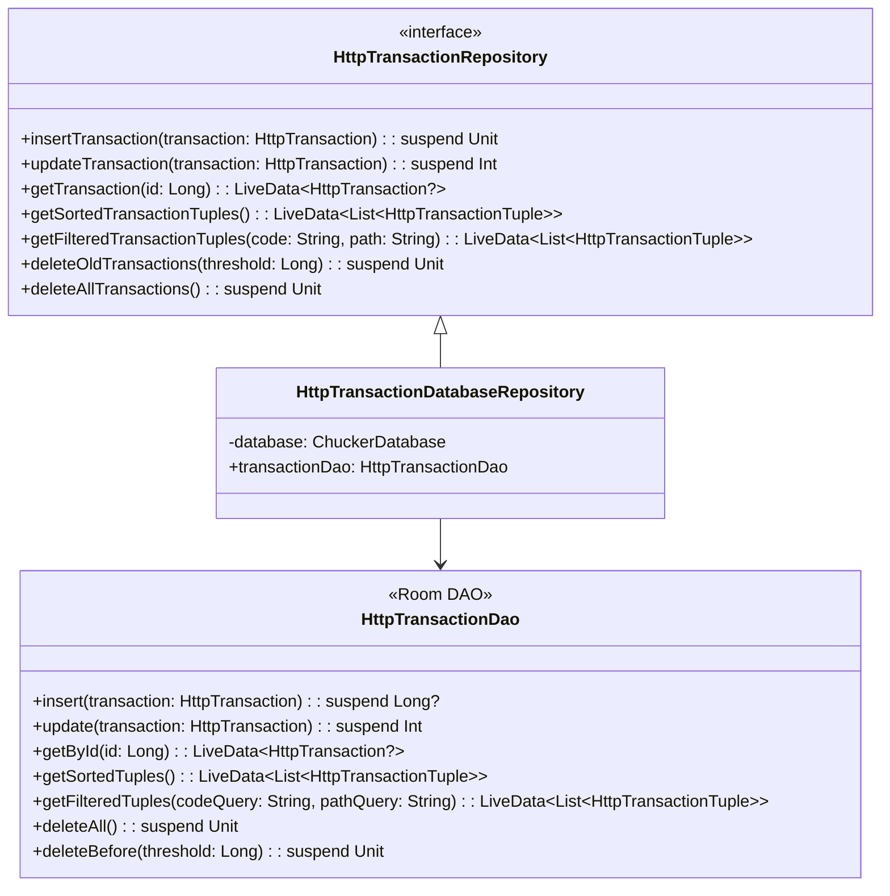
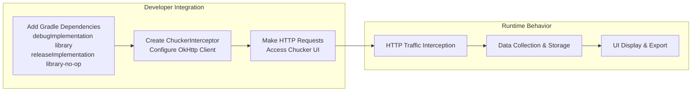

# Core API

<details>
<summary>Relevant source files</summary>

The following files were used as context for generating this wiki page:

- [CHANGELOG.md](CHANGELOG.md)
- [README.md](README.md)
- [gradle.properties](gradle.properties)
- [library/src/main/kotlin/com/chuckerteam/chucker/api/Chucker.kt](library/src/main/kotlin/com/chuckerteam/chucker/api/Chucker.kt)
- [library/src/main/kotlin/com/chuckerteam/chucker/internal/data/repository/HttpTransactionDatabaseRepository.kt](library/src/main/kotlin/com/chuckerteam/chucker/internal/data/repository/HttpTransactionDatabaseRepository.kt)
- [library/src/main/kotlin/com/chuckerteam/chucker/internal/data/repository/HttpTransactionRepository.kt](library/src/main/kotlin/com/chuckerteam/chucker/internal/data/repository/HttpTransactionRepository.kt)
- [library/src/main/kotlin/com/chuckerteam/chucker/internal/data/room/HttpTransactionDao.kt](library/src/main/kotlin/com/chuckerteam/chucker/internal/data/room/HttpTransactionDao.kt)

</details>


The Core API provides the primary interface for integrating Chucker into Android applications. This includes the main interceptor for capturing HTTP traffic, data collection and management components, and utility methods for interacting with the library programmatically.

For detailed interceptor configuration, see [ChuckerInterceptor](#4.1). For data layer implementation details, see [Data Management](#4.2).

## API Overview

The Chucker Core API consists of three main components that work together to provide HTTP inspection capabilities:

### Core API Architecture



Sources: [library/src/main/kotlin/com/chuckerteam/chucker/api/Chucker.kt:1-117](), [README.md:93-128]()

## Component Relationships

The Core API components interact in a layered architecture where the interceptor captures HTTP events, the collector manages data lifecycle, and the repository handles persistence:



Sources: [library/src/main/kotlin/com/chuckerteam/chucker/internal/data/repository/HttpTransactionRepository.kt:1-32](), [README.md:45-51]()

## ChuckerInterceptor

The `ChuckerInterceptor` is the primary entry point for HTTP traffic capture. It integrates with OkHttp clients to intercept and record HTTP requests and responses.

### Basic Usage

```kotlin
val client = OkHttpClient.Builder()
    .addInterceptor(ChuckerInterceptor(context))
    .build()
```

### Builder Pattern Configuration

```kotlin
val chuckerInterceptor = ChuckerInterceptor.Builder(context)
    .collector(chuckerCollector)
    .maxContentLength(250_000L)
    .redactHeaders("Auth-Token", "Bearer")
    .alwaysReadResponseBody(true)
    .addBodyDecoder(decoder)
    .createShortcut(true)
    .build()
```

**Key Configuration Options:**
- `collector()` - Custom ChuckerCollector instance
- `maxContentLength()` - Maximum body content length before truncation
- `redactHeaders()` - Headers to redact in the UI for security
- `alwaysReadResponseBody()` - Read complete response even if client doesn't consume it
- `addBodyDecoder()` - Custom decoders for binary content
- `createShortcut()` - Create Android dynamic shortcut

Sources: [README.md:106-128]()

## ChuckerCollector

The `ChuckerCollector` manages data collection, retention policies, and notification display. It acts as an intermediary between the interceptor and the data repository.

### Configuration

```kotlin
val chuckerCollector = ChuckerCollector(
    context = this,
    showNotification = true,
    retentionPeriod = RetentionManager.Period.ONE_HOUR
)
```

**Configuration Parameters:**
- `context` - Android application context
- `showNotification` - Toggle visibility of persistent notifications
- `retentionPeriod` - Data retention period for automatic cleanup

Sources: [README.md:96-103]()

## Chucker Utility Class

The `Chucker` object provides static utility methods for programmatic interaction with the library:

### Core Utility Methods

| Method | Purpose | Return Type |
|--------|---------|-------------|
| `getLaunchIntent(context)` | Get intent to launch Chucker UI | `Intent` |
| `dismissNotifications(context)` | Dismiss all Chucker notifications | `Unit` |
| `clearTransactions()` | Clear all stored transaction data | `suspend Unit` |
| `generateHar(context, limit)` | Export transactions as HAR format | `suspend ByteArray` |
| `isOp` | Check if operational (vs no-op) instance | `Boolean` |

### Implementation Details



**Key Features:**
- **Operational Detection**: `isOp` property distinguishes between full library and no-op variant
- **UI Integration**: `getLaunchIntent()` provides direct access to Chucker UI from host apps
- **Data Export**: `generateHar()` enables programmatic export of HTTP transactions
- **Notification Management**: Centralized notification dismissal across the library

Sources: [library/src/main/kotlin/com/chuckerteam/chucker/api/Chucker.kt:24-116]()

## Data Management API

The data layer provides repository pattern interfaces for managing HTTP transaction persistence:

### Repository Interface

The `HttpTransactionRepository` defines the contract for data operations:

| Operation | Method | Purpose |
|-----------|--------|---------|
| **Create** | `insertTransaction(transaction)` | Store new HTTP transaction |
| **Update** | `updateTransaction(transaction)` | Update existing transaction |
| **Query** | `getTransaction(transactionId)` | Get single transaction by ID |
| **Query** | `getSortedTransactionTuples()` | Get all transactions sorted by date |
| **Query** | `getFilteredTransactionTuples(code, path)` | Get filtered transaction list |
| **Cleanup** | `deleteOldTransactions(threshold)` | Remove transactions older than threshold |
| **Cleanup** | `deleteAllTransactions()` | Clear all stored transactions |

### Database Implementation



**Repository Features:**
- **Room Integration**: Uses Android Architecture Components Room for SQLite operations
- **LiveData Support**: Reactive data queries return `LiveData` for UI observation
- **Coroutine Support**: Async operations use Kotlin coroutines with `suspend` functions
- **Query Flexibility**: Supports filtering by response code and request path

Sources: [library/src/main/kotlin/com/chuckerteam/chucker/internal/data/repository/HttpTransactionRepository.kt:1-32](), [library/src/main/kotlin/com/chuckerteam/chucker/internal/data/repository/HttpTransactionDatabaseRepository.kt:1-48](), [library/src/main/kotlin/com/chuckerteam/chucker/internal/data/room/HttpTransactionDao.kt:1-51]()

## Integration Pattern

The typical integration flow follows this pattern:



**Integration Steps:**
1. **Dependency Setup**: Add both operational and no-op variants to Gradle dependencies
2. **Interceptor Configuration**: Create and configure `ChuckerInterceptor` instance
3. **OkHttp Integration**: Add interceptor to OkHttp client builder
4. **Runtime Operation**: Library automatically captures and displays HTTP traffic

Sources: [README.md:34-67]()
