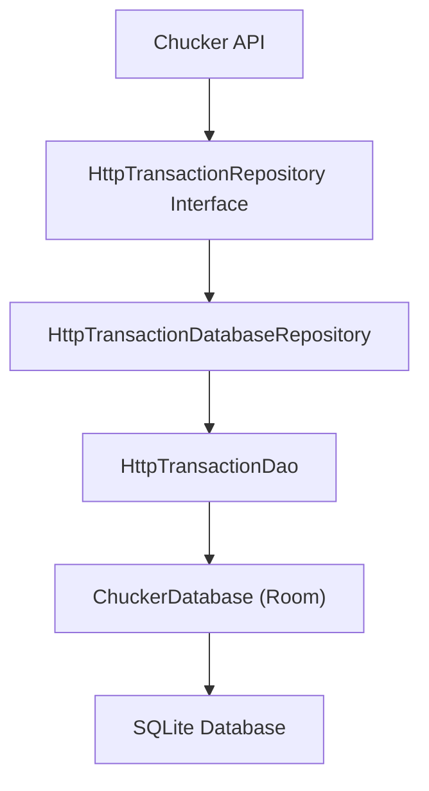
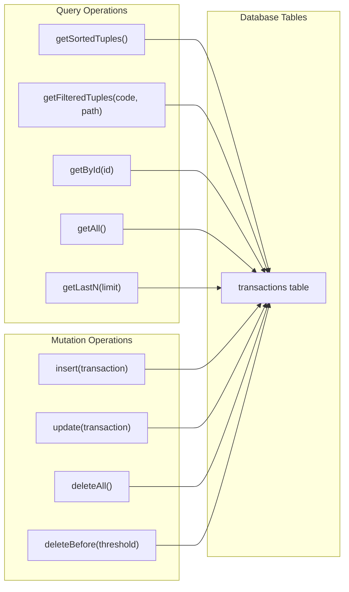
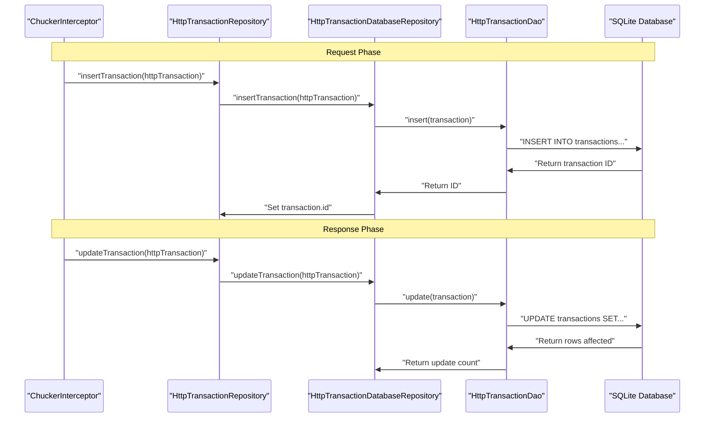
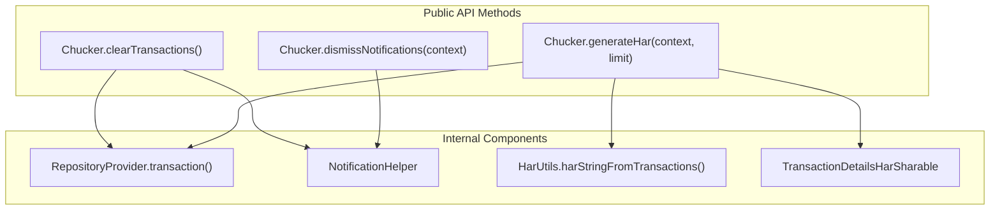

# Data Management

Relevant source files

The following files were used as context for generating this wiki page:

- [library/src/main/kotlin/com/chuckerteam/chucker/api/Chucker.kt](library/src/main/kotlin/com/chuckerteam/chucker/api/Chucker.kt)
- [library/src/main/kotlin/com/chuckerteam/chucker/internal/data/repository/HttpTransactionDatabaseRepository.kt](library/src/main/kotlin/com/chuckerteam/chucker/internal/data/repository/HttpTransactionDatabaseRepository.kt)
- [library/src/main/kotlin/com/chuckerteam/chucker/internal/data/repository/HttpTransactionRepository.kt](library/src/main/kotlin/com/chuckerteam/chucker/internal/data/repository/HttpTransactionRepository.kt)
- [library/src/main/kotlin/com/chuckerteam/chucker/internal/data/room/HttpTransactionDao.kt](library/src/main/kotlin/com/chuckerteam/chucker/internal/data/room/HttpTransactionDao.kt)

## Purpose and Scope

This document covers Chucker's data management layer, which handles the storage, retrieval, and lifecycle management of HTTP transaction data. The data management system uses a repository pattern with Room database persistence to store intercepted HTTP requests and responses for inspection in the Chucker UI.

For information about the UI components that display this data, see [User Interface](#5). For details about how transactions are initially captured, see [ChuckerInterceptor](#4.1).

## Repository Pattern Architecture

Chucker implements a clean repository pattern to abstract data operations from the UI and business logic layers. The architecture consists of three main components:

**Repository Interface Operations**

The `HttpTransactionRepository` interface defines all data operations needed for transaction management:

| Operation | Purpose | Return Type |
|-----------|---------|-------------|
| `insertTransaction()` | Store new HTTP transaction | `suspend fun` |
| `updateTransaction()` | Update existing transaction with response data | `suspend fun` |
| `deleteAllTransactions()` | Clear all stored transactions | `suspend fun` |
| `deleteOldTransactions()` | Remove transactions older than threshold | `suspend fun` |
| `getSortedTransactionTuples()` | Get transaction summaries sorted by date | `LiveData<List<HttpTransactionTuple>>` |
| `getFilteredTransactionTuples()` | Get filtered transactions by code and path | `LiveData<List<HttpTransactionTuple>>` |
| `getTransaction()` | Get full transaction details by ID | `LiveData<HttpTransaction?>` |

Sources: [library/src/main/kotlin/com/chuckerteam/chucker/internal/data/repository/HttpTransactionRepository.kt:1-31]()

## Database Operations and Queries

The `HttpTransactionDao` implements Room database operations with optimized SQL queries for transaction data access:

**Key Database Queries**

The DAO uses several optimized queries for different use cases:

- **Sorted Tuples Query**: Returns transaction summaries ordered by `requestDate DESC` for the main transaction list
- **Filtered Query**: Uses `LIKE` operators on `responseCode` and `path` fields with wildcard matching
- **Cleanup Query**: Removes transactions where `requestDate <= threshold` for retention management

Sources: [library/src/main/kotlin/com/chuckerteam/chucker/internal/data/room/HttpTransactionDao.kt:1-50]()

## Transaction Data Flow

The following diagram shows how transaction data flows through the system from capture to storage:

Sources: [library/src/main/kotlin/com/chuckerteam/chucker/internal/data/repository/HttpTransactionDatabaseRepository.kt:31-37]()

## Data Retention and Cleanup

Chucker provides several mechanisms for managing transaction data lifecycle:

**Automatic Cleanup**

The `ChuckerCollector` implements automatic retention policies to prevent unbounded database growth by calling `deleteOldTransactions()` with a timestamp threshold.

**Manual Cleanup Operations**

| Method | Scope | Usage |
|--------|-------|-------|
| `deleteAllTransactions()` | All transactions | Complete data reset |
| `deleteOldTransactions(threshold)` | Transactions before timestamp | Retention policy enforcement |
| `Chucker.clearTransactions()` | All transactions + notifications | Public API cleanup |

**Notification Buffer Management**

The cleanup process also clears the notification buffer via `NotificationHelper.clearBuffer()` to ensure consistency between stored data and active notifications.

Sources: [library/src/main/kotlin/com/chuckerteam/chucker/internal/data/repository/HttpTransactionDatabaseRepository.kt:27-42](), [library/src/main/kotlin/com/chuckerteam/chucker/api/Chucker.kt:83-86]()

## Public API Integration

The `Chucker` object provides high-level data management operations that abstract the repository layer:

**HAR Export Functionality**

The `generateHar()` method demonstrates advanced data export capabilities:

1. Retrieves the last N transactions via `getLastTransactions(limit)`
2. Converts transaction data to HAR format using `HarUtils.harStringFromTransactions()`
3. Creates shareable content via `TransactionDetailsHarSharable`
4. Returns compressed byte array for export or sharing

Sources: [library/src/main/kotlin/com/chuckerteam/chucker/api/Chucker.kt:83-99]()

## LiveData Integration

The repository layer leverages Android's `LiveData` for reactive UI updates. Key reactive operations include:

- `getSortedTransactionTuples()`: Powers the main transaction list with automatic updates
- `getFilteredTransactionTuples()`: Supports real-time search filtering
- `getTransaction()`: Provides detailed transaction view with content change detection

The `distinctUntilChanged()` extension ensures UI updates only occur when transaction content actually changes, using the `hasTheSameContent()` method for efficient comparison.

Sources: [library/src/main/kotlin/com/chuckerteam/chucker/internal/data/repository/HttpTransactionDatabaseRepository.kt:18-21]()
