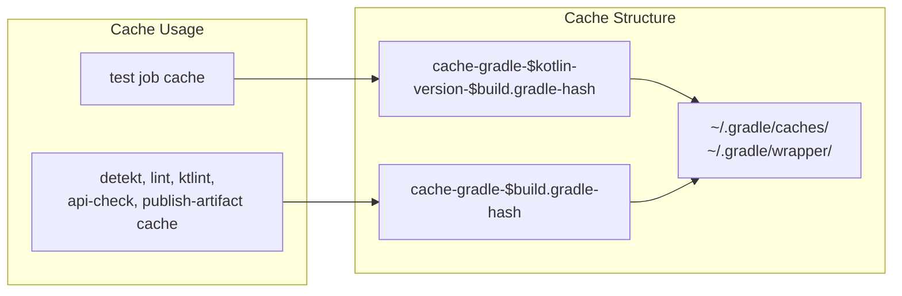

# CI/CD Pipeline

Relevant source files

The following files were used as context for generating this wiki page:

- [.github/workflows/auto_rebase.yaml](.github/workflows/auto_rebase.yaml)
- [.github/workflows/auto_revert.yaml](.github/workflows/auto_revert.yaml)
- [.github/workflows/close-and-release-repository.yaml](.github/workflows/close-and-release-repository.yaml)
- [.github/workflows/gradle-wrapper-validation.yml](.github/workflows/gradle-wrapper-validation.yml)
- [.github/workflows/pre-merge.yaml](.github/workflows/pre-merge.yaml)
- [.github/workflows/publish-release.yaml](.github/workflows/publish-release.yaml)
- [.github/workflows/publish-snapshot.yaml](.github/workflows/publish-snapshot.yaml)

This document describes the continuous integration and continuous deployment (CI/CD) pipeline for Chucker, implemented using GitHub Actions workflows. The pipeline provides automated testing, quality checks, and publishing capabilities for the multi-module Android library project.

For information about the underlying build system and Gradle configuration, see [Build System](#3). For general contributing guidelines and development practices, see [Contributing Guidelines](#7.2).

## Overview

The CI/CD pipeline consists of seven GitHub Actions workflows that handle different aspects of the development and release process. The workflows are designed to ensure code quality, automate publishing, and provide developer productivity tools.

### Workflow Architecture

```mermaid
graph TD
    subgraph "Trigger Events"
        PR["Pull Request"]
        PUSH_DEV["Push to develop"]
        TAG_PUSH["Git Tag Push"]
        COMMENT["/rebase or /revert comment"]
        MANUAL["Manual Dispatch"]
    end
    
    subgraph "Pre-Merge Validation"
        TEST_JOB["test job<br/>./gradlew test"]
        DETEKT_JOB["detekt job<br/>./gradlew detekt"]
        LINT_JOB["lint job<br/>./gradlew lint"]
        KTLINT_JOB["ktlint job<br/>./gradlew ktlintCheck"]
        API_CHECK_JOB["api-check job<br/>./gradlew apiCheck"]
        PUBLISH_ARTIFACT_JOB["publish-artifact job<br/>./gradlew publishToMavenLocal"]
        GRADLE_VALIDATION["gradle-wrapper-validation<br/>wrapper-validation-action"]
    end
    
    subgraph "Publishing Workflows"
        SNAPSHOT["publish-snapshot.yaml<br/>publishReleasePublicationToSnapshotRepository"]
        RELEASE["publish-release.yaml<br/>publishReleasePublicationToStagingRepository"]
        CLOSE_RELEASE["close-and-release-repository.yaml<br/>closeAndReleaseStagingRepository"]
    end
    
    subgraph "Automation Tools"
        REBASE["auto_rebase.yaml<br/>cirrus-actions/rebase"]
        REVERT["auto_revert.yaml<br/>srt32/revert"]
    end
    
    PR --> TEST_JOB
    PR --> DETEKT_JOB
    PR --> LINT_JOB
    PR --> KTLINT_JOB
    PR --> API_CHECK_JOB
    PR --> PUBLISH_ARTIFACT_JOB
    PR --> GRADLE_VALIDATION
    
    PUSH_DEV --> TEST_JOB
    PUSH_DEV --> DETEKT_JOB
    PUSH_DEV --> LINT_JOB
    PUSH_DEV --> KTLINT_JOB
    PUSH_DEV --> API_CHECK_JOB
    PUSH_DEV --> PUBLISH_ARTIFACT_JOB
    PUSH_DEV --> SNAPSHOT
    
    TAG_PUSH --> RELEASE
    MANUAL --> CLOSE_RELEASE
    COMMENT --> REBASE
    COMMENT --> REVERT
```

Sources: [.github/workflows/pre-merge.yaml:1-162](), [.github/workflows/publish-snapshot.yaml:1-39](), [.github/workflows/publish-release.yaml:1-35]()

## Pre-Merge Quality Gates

The primary CI workflow is defined in `pre-merge.yaml` and runs comprehensive quality checks on every pull request and push to the develop branch. This workflow consists of six parallel jobs that must all pass before code can be merged.

### Quality Check Jobs

| Job Name | Gradle Task | Purpose | Caching Strategy |
|----------|-------------|---------|------------------|
| `test` | `./gradlew test` | Unit test execution | Gradle cache with Kotlin version key |
| `detekt` | `./gradlew detekt` | Static code analysis | Standard Gradle cache |
| `lint` | `./gradlew lint` | Android lint checks | Standard Gradle cache |
| `ktlint` | `./gradlew ktlintCheck` | Kotlin code style validation | Standard Gradle cache |
| `api-check` | `./gradlew apiCheck` | Binary compatibility validation | Standard Gradle cache |
| `publish-artifact` | `./gradlew publishToMavenLocal` | Local publishing test | Standard Gradle cache |

Sources: [.github/workflows/pre-merge.yaml:14-43](), [.github/workflows/pre-merge.yaml:44-65](), [.github/workflows/pre-merge.yaml:66-87](), [.github/workflows/pre-merge.yaml:88-109](), [.github/workflows/pre-merge.yaml:110-131](), [.github/workflows/pre-merge.yaml:132-162]()

### Caching Strategy

The workflows implement Gradle caching to improve build performance. The cache strategy uses different keys for different workflows:

Sources: [.github/workflows/pre-merge.yaml:27-36](), [.github/workflows/pre-merge.yaml:51-58]()

### Workflow Cancellation

The pre-merge workflow includes automatic cancellation of previous runs when new commits are pushed to a pull request, implemented using `styfle/cancel-workflow-action@0.9.1`.

Sources: [.github/workflows/pre-merge.yaml:18-22]()

## Publishing Workflows

Chucker uses a multi-stage publishing strategy with separate workflows for snapshot and release publishing.

### Snapshot Publishing

The `publish-snapshot.yaml` workflow automatically publishes snapshot versions when code is pushed to the `develop` branch. This workflow only runs on the official `ChuckerTeam/chucker` repository.

**Key Features:**
- Repository restriction: `${{ github.repository == 'ChuckerTeam/chucker'}}`
- Publishes to snapshot repository via `publishReleasePublicationToSnapshotRepository`
- Creates and uploads build artifacts as `chucker-snapshot-artifacts`
- Includes artifact signing with environment-provided keys

Sources: [.github/workflows/publish-snapshot.yaml:8-39]()

### Release Publishing

The `publish-release.yaml` workflow handles official releases triggered by Git tag pushes. It publishes to a staging repository that requires manual promotion to Maven Central.

**Key Features:**
- Triggered by any Git tag push
- Repository restriction: `${{ github.repository == 'ChuckerTeam/chucker'}}`
- Publishes to staging repository via `publishReleasePublicationToStagingRepository`
- Creates and uploads build artifacts as `chucker-release-artifacts`
- Uses `--no-parallel` flag for reliable publishing

Sources: [.github/workflows/publish-release.yaml:8-35]()

### Repository Management

The `close-and-release-repository.yaml` workflow provides manual control over the final release process, allowing maintainers to close and release staging repositories on demand.

**Features:**
- Manual trigger only (`workflow_dispatch`)
- Executes `closeAndReleaseStagingRepository` Gradle task
- Requires Nexus credentials for repository management

Sources: [.github/workflows/close-and-release-repository.yaml:1-17]()

## Security and Environment Variables

The CI/CD pipeline uses several environment variables and GitHub secrets for secure operations:

### Required Secrets

| Secret Name | Usage | Workflows |
|-------------|-------|-----------|
| `ORG_GRADLE_PROJECT_SIGNING_KEY` | Artifact signing key | pre-merge, publish-snapshot, publish-release |
| `ORG_GRADLE_PROJECT_SIGNING_PWD` | Artifact signing password | pre-merge, publish-snapshot, publish-release |
| `ORG_GRADLE_PROJECT_NEXUS_USERNAME` | Maven repository username | publish-snapshot, publish-release, close-and-release |
| `ORG_GRADLE_PROJECT_NEXUS_PASSWORD` | Maven repository password | publish-snapshot, publish-release, close-and-release |
| `GITHUB_TOKEN` | GitHub API access | auto_rebase, auto_revert |

Sources: [.github/workflows/pre-merge.yaml:150-152](), [.github/workflows/publish-snapshot.yaml:36-39](), [.github/workflows/publish-release.yaml:31-34]()

## Supporting Workflows

### Gradle Wrapper Validation

The `gradle-wrapper-validation.yml` workflow ensures the integrity of the Gradle wrapper files using the official `gradle/wrapper-validation-action@v1`. This workflow runs on the same triggers as the pre-merge checks.

Sources: [.github/workflows/gradle-wrapper-validation.yml:1-23]()

### Developer Productivity Tools

Two workflows provide automated assistance for pull request management:

**Automatic Rebase (`auto_rebase.yaml`):**
- Triggered by `/rebase` comments on pull requests
- Uses `cirrus-actions/rebase@1.5` action
- Includes fallback job to prevent workflow failure when conditions aren't met

Sources: [.github/workflows/auto_rebase.yaml:1-27]()

**Automatic Revert (`auto_revert.yaml`):**
- Triggered by `/revert` comments on issues or pull requests  
- Uses `srt32/revert@v0.0.1` action
- Provides quick commit reversion functionality

Sources: [.github/workflows/auto_revert.yaml:1-17]()

## Workflow Execution Matrix

The following table summarizes when each workflow executes:

| Workflow | Pull Request | Push to develop | Git Tag | Manual | Issue Comment |
|----------|-------------|-----------------|---------|--------|---------------|
| pre-merge.yaml | ✅ | ✅ | ❌ | ✅ | ❌ |
| gradle-wrapper-validation.yml | ✅ | ✅ | ❌ | ✅ | ❌ |
| publish-snapshot.yaml | ❌ | ✅* | ❌ | ❌ | ❌ |
| publish-release.yaml | ❌ | ❌ | ✅* | ❌ | ❌ |
| close-and-release-repository.yaml | ❌ | ❌ | ❌ | ✅ | ❌ |
| auto_rebase.yaml | ❌ | ❌ | ❌ | ❌ | ✅ (/rebase) |
| auto_revert.yaml | ❌ | ❌ | ❌ | ❌ | ✅ (/revert) |

*Only on official ChuckerTeam/chucker repository

Sources: [.github/workflows/pre-merge.yaml:2-11](), [.github/workflows/publish-snapshot.yaml:2-5](), [.github/workflows/publish-release.yaml:2-5]()
