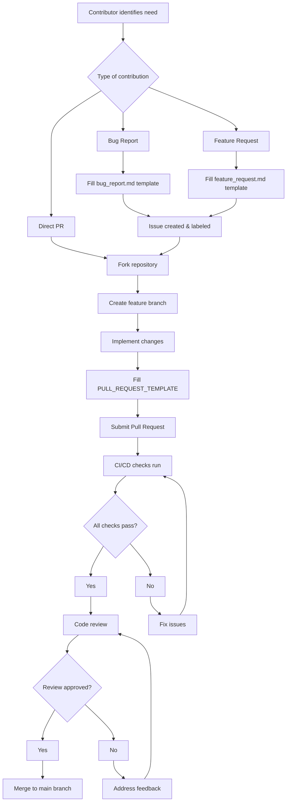
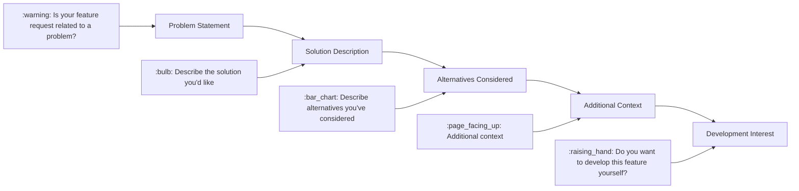
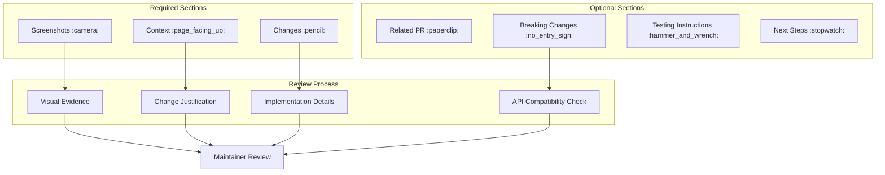

# Contributing Guidelines

<details>
<summary>Relevant source files</summary>

The following files were used as context for generating this wiki page:

- [.github/ISSUE_TEMPLATE/bug_report.md](.github/ISSUE_TEMPLATE/bug_report.md)
- [.github/ISSUE_TEMPLATE/feature_request.md](.github/ISSUE_TEMPLATE/feature_request.md)
- [.github/PULL_REQUEST_TEMPLATE](.github/PULL_REQUEST_TEMPLATE)

</details>


This document provides guidelines and templates for contributing to the Chucker project, including pull request formats, issue reporting procedures, and development workflow expectations. For information about the CI/CD pipeline and automated testing processes, see [CI/CD Pipeline](#7.1).

## Purpose and Scope

This section covers the standardized templates and procedures for external contributions to the Chucker codebase. It documents the GitHub issue templates, pull request template, and expected formats for bug reports and feature requests. The templates ensure consistent information gathering and help maintainers efficiently process contributions.

## Contribution Workflow

The following diagram illustrates the standard contribution process from issue creation to pull request merge:



Sources: [.github/PULL_REQUEST_TEMPLATE:1-22](), [.github/ISSUE_TEMPLATE/bug_report.md:1-30](), [.github/ISSUE_TEMPLATE/feature_request.md:1-23]()

## Issue Templates

### Bug Report Template

The bug report template located at `.github/ISSUE_TEMPLATE/bug_report.md` structures issue reports with the following sections:

| Section | Required Fields | Purpose |
|---------|----------------|---------|
| Bug Description | `:writing_hand: Describe the bug` | Clear problem statement |
| Reproduction Steps | `:bomb: Steps to reproduce` | Numbered steps to recreate issue |
| Expected Behavior | `:wrench: Expected behavior` | What should happen instead |
| Screenshots | `:camera: Screenshots` | Visual evidence of the problem |
| Technical Information | `:iphone: Tech info` | Device, OS version, Chucker version |
| Additional Context | `:page_facing_up: Additional context` | Any other relevant information |

The template uses emoji prefixes for visual organization and includes specific fields for device compatibility testing, which is crucial for Android library development.

Sources: [.github/ISSUE_TEMPLATE/bug_report.md:7-30]()

### Feature Request Template

The feature request template at `.github/ISSUE_TEMPLATE/feature_request.md` captures feature proposals:



The template includes a self-assignment field where contributors can indicate if they want to implement the feature themselves, helping maintainers prioritize and coordinate development efforts.

Sources: [.github/ISSUE_TEMPLATE/feature_request.md:7-22]()

## Pull Request Template

The pull request template at `.github/PULL_REQUEST_TEMPLATE` ensures comprehensive change documentation:



### Template Section Details

The pull request template includes these standardized sections:

- **Screenshots** (`:camera:`): Visual documentation of UI changes or new features
- **Context** (`:page_facing_up:`): Links to related issues and justification for changes
- **Changes** (`:pencil:`): Technical description of code modifications with CHANGELOG.md update reminder
- **Related PR** (`:paperclip:`): Dependencies and blocking relationships
- **Breaking Changes** (`:no_entry_sign:`): API compatibility impact assessment
- **Testing Instructions** (`:hammer_and_wrench:`): Specific test scenarios for reviewers
- **Next Steps** (`:stopwatch:`): Post-merge planning and follow-up tasks

Sources: [.github/PULL_REQUEST_TEMPLATE:1-22]()

## Code Quality Expectations

### CHANGELOG.md Updates

The pull request template specifically reminds contributors to update the `CHANGELOG.md` file for user-facing changes:

> If your changes affect users somehow, be it a new feature, a bugfix or an API change please update the `Unreleased` section in the CHANGELOG.md file.

This ensures proper version documentation and release notes preparation.

### Breaking Change Assessment

Contributors must explicitly document any breaking changes in the `:no_entry_sign: Breaking` section, asking:

> Is there something breaking the API? Any class or method signature changed?

This is critical for the library's semantic versioning and helps maintainers make informed release decisions.

Sources: [.github/PULL_REQUEST_TEMPLATE:9](), [.github/PULL_REQUEST_TEMPLATE:14-15]()

## Template Integration with GitHub

The issue templates are automatically presented to users when creating new issues through GitHub's web interface. The naming convention and YAML front matter ensure proper categorization:

```yaml
---
name: Bug report
about: Create a report to help us improve
---
```

```yaml
---
name: Feature request
about: Suggest an idea for this project
---
```

This integration streamlines the contribution process and ensures consistent information gathering from the start of each contribution workflow.

Sources: [.github/ISSUE_TEMPLATE/bug_report.md:1-5](), [.github/ISSUE_TEMPLATE/feature_request.md:1-5]()
