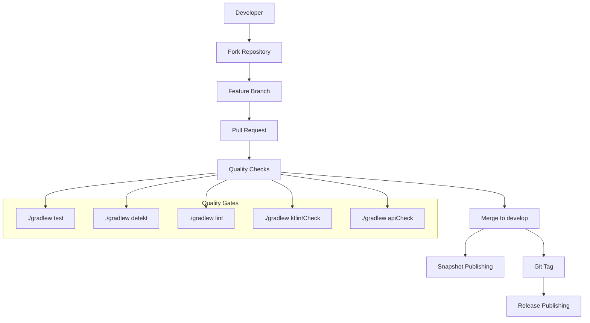
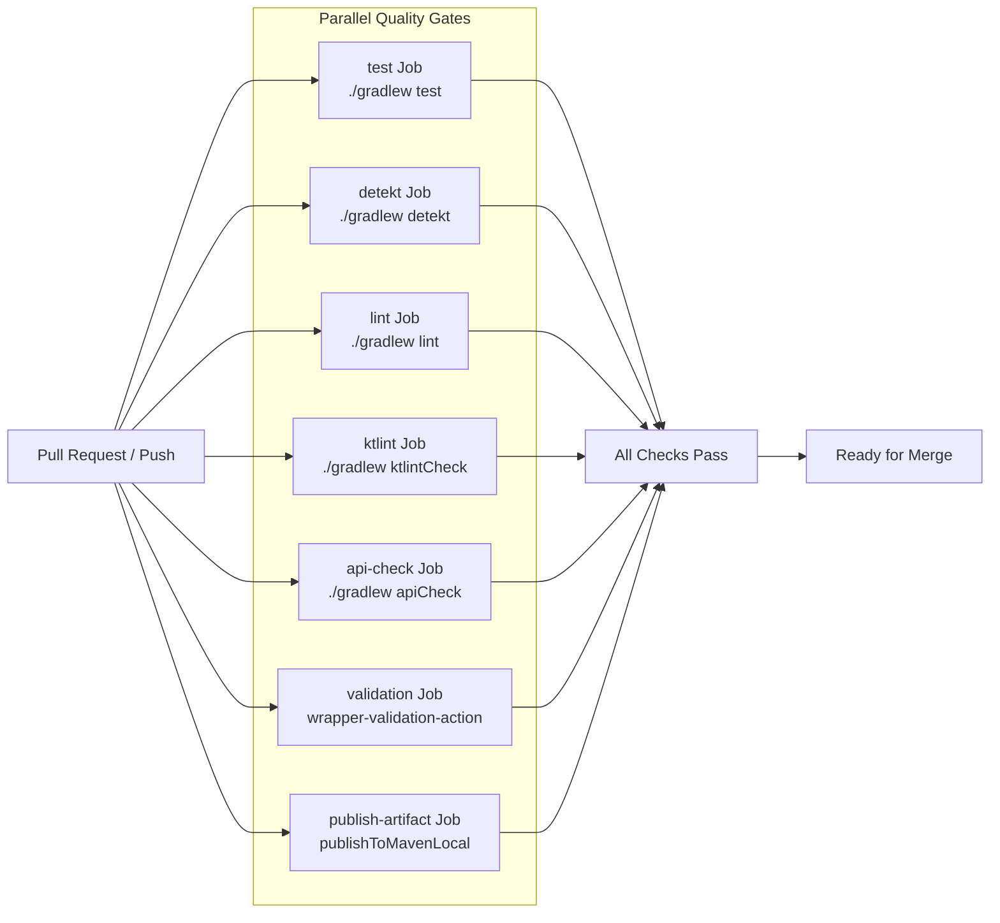
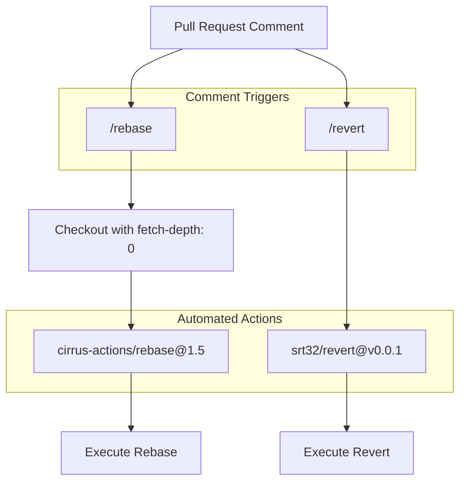
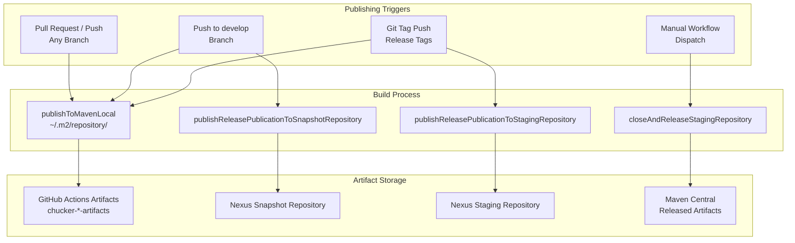

# Development and Contributing

<details>
<summary>Relevant source files</summary>

The following files were used as context for generating this wiki page:

- [.github/ISSUE_TEMPLATE/bug_report.md](.github/ISSUE_TEMPLATE/bug_report.md)
- [.github/ISSUE_TEMPLATE/feature_request.md](.github/ISSUE_TEMPLATE/feature_request.md)
- [.github/PULL_REQUEST_TEMPLATE](.github/PULL_REQUEST_TEMPLATE)
- [.github/workflows/auto_rebase.yaml](.github/workflows/auto_rebase.yaml)
- [.github/workflows/auto_revert.yaml](.github/workflows/auto_revert.yaml)
- [.github/workflows/close-and-release-repository.yaml](.github/workflows/close-and-release-repository.yaml)
- [.github/workflows/gradle-wrapper-validation.yml](.github/workflows/gradle-wrapper-validation.yml)
- [.github/workflows/pre-merge.yaml](.github/workflows/pre-merge.yaml)
- [.github/workflows/publish-release.yaml](.github/workflows/publish-release.yaml)
- [.github/workflows/publish-snapshot.yaml](.github/workflows/publish-snapshot.yaml)

</details>


This document provides comprehensive guidance for developers contributing to the Chucker project, covering development workflows, code quality requirements, continuous integration processes, and publishing procedures. It details the automated systems that ensure code quality and handle artifact distribution to Maven repositories.

For information about the build system structure and module organization, see [Build System](#3). For details about the CI/CD pipeline implementation, see [CI/CD Pipeline](#7.1).

## Development Workflow Overview

The Chucker project employs a sophisticated development workflow centered around the `develop` branch with automated quality gates, testing, and publishing mechanisms. The workflow supports both snapshot and release publishing cycles with comprehensive validation at each stage.

### Development Flow



**Development Branch Flow**
- `develop`: Main development branch for ongoing work
- Feature branches: Created from `develop` for specific features or fixes
- Pull requests: Must pass all quality checks before merge
- Tags: Trigger release publishing to staging repository

Sources: [.github/workflows/pre-merge.yaml:1-162](), [.github/workflows/publish-snapshot.yaml:1-39](), [.github/workflows/publish-release.yaml:1-35]()

## Code Quality Requirements

All contributions must satisfy multiple automated quality checks before merge. These checks ensure code consistency, maintainability, and API stability.

### Quality Check Matrix

| Check Type | Gradle Task | Purpose | Trigger |
|------------|-------------|---------|---------|
| Unit Tests | `./gradlew test` | Verify functionality | All PRs & pushes |
| Static Analysis | `./gradlew detekt` | Code quality analysis | All PRs & pushes |
| Android Lint | `./gradlew lint` | Android-specific checks | All PRs & pushes |
| Code Style | `./gradlew ktlintCheck` | Kotlin style enforcement | All PRs & pushes |
| API Compatibility | `./gradlew apiCheck` | Binary compatibility validation | All PRs & pushes |
| Gradle Wrapper | `gradle/wrapper-validation-action@v1` | Security validation | All PRs & pushes |

### Pre-merge Check Pipeline



Sources: [.github/workflows/pre-merge.yaml:13-161](), [.github/workflows/gradle-wrapper-validation.yml:1-23]()

## Contributing Guidelines

### Pull Request Process

Contributors must follow the structured pull request template and ensure all quality checks pass before requesting review.

**Pull Request Template Structure:**
- **Screenshots**: Visual evidence of changes
- **Context**: Issue references and rationale
- **Changes**: Technical details of modifications  
- **Related PR**: Dependencies and blocking relationships
- **Breaking**: API compatibility impact assessment
- **Testing**: Validation procedures
- **Next Steps**: Post-merge planning

### Issue Templates

The project provides standardized templates for different issue types:

**Bug Report Template** [`bug_report.md`]():
- Bug description with reproduction steps
- Expected vs actual behavior
- Technical environment details (device, OS, Chucker version)
- Supporting screenshots and context

**Feature Request Template** [`feature_request.md`]():
- Problem statement and proposed solution
- Alternative approaches considered
- Implementation interest indication

Sources: [.github/PULL_REQUEST_TEMPLATE:1-22](), [.github/ISSUE_TEMPLATE/bug_report.md:1-30](), [.github/ISSUE_TEMPLATE/feature_request.md:1-23]()

## Automated Development Tools

### Comment-Driven Actions

The repository supports automated actions triggered by pull request comments:



**Rebase Automation:**
- Trigger: Comment containing `/rebase`
- Action: `cirrus-actions/rebase@1.5`
- Scope: Pull requests only

**Revert Automation:**
- Trigger: Comment containing `/revert` 
- Action: `srt32/revert@v0.0.1`
- Scope: Any issue comment

Sources: [.github/workflows/auto_rebase.yaml:1-27](), [.github/workflows/auto_revert.yaml:1-17]()

## Publishing Pipeline

### Artifact Publishing Flow

The publishing system handles three distinct publication scenarios with different triggers and destinations.



### Repository Authentication

Publishing requires secure credential management through GitHub Secrets:

| Secret | Purpose | Usage |
|--------|---------|-------|
| `ORG_GRADLE_PROJECT_SIGNING_KEY` | Artifact signing | All publishing workflows |
| `ORG_GRADLE_PROJECT_SIGNING_PWD` | Signing key password | All publishing workflows |
| `ORG_GRADLE_PROJECT_NEXUS_USERNAME` | Nexus repository access | Snapshot & release publishing |
| `ORG_GRADLE_PROJECT_NEXUS_PASSWORD` | Nexus authentication | Snapshot & release publishing |

### Publishing Workflow Details

**Snapshot Publishing** ([.github/workflows/publish-snapshot.yaml]()):
- **Trigger**: Push to `develop` branch
- **Condition**: `github.repository == 'ChuckerTeam/chucker'`
- **Tasks**: `publishToMavenLocal`, `publishReleasePublicationToSnapshotRepository`
- **Parallelization**: Disabled (`--no-parallel`)

**Release Publishing** ([.github/workflows/publish-release.yaml]()):
- **Trigger**: Git tag push
- **Condition**: `github.repository == 'ChuckerTeam/chucker'`  
- **Tasks**: `publishToMavenLocal`, `publishReleasePublicationToStagingRepository`
- **Parallelization**: Disabled (`--no-parallel`)

**Manual Release** ([.github/workflows/close-and-release-repository.yaml]()):
- **Trigger**: Manual workflow dispatch
- **Task**: `closeAndReleaseStagingRepository`
- **Purpose**: Promote staged artifacts to Maven Central

Sources: [.github/workflows/publish-snapshot.yaml:8-39](), [.github/workflows/publish-release.yaml:8-35](), [.github/workflows/close-and-release-repository.yaml:1-17]()

## Development Environment Setup

### Local Development Requirements

- **Gradle Wrapper**: Use `./gradlew` for consistent build environment
- **Java**: Compatible JVM as specified in build configuration
- **Android SDK**: Required for Android-specific lint and build tasks
- **Git**: For version control and automated workflows

### Common Development Tasks

| Task | Command | Purpose |
|------|---------|---------|
| Run Tests | `./gradlew test` | Execute unit test suite |
| Check Code Style | `./gradlew ktlintCheck` | Validate Kotlin code formatting |
| Apply Code Style | `./gradlew ktlintFormat` | Auto-format Kotlin code |
| Static Analysis | `./gradlew detekt` | Run detekt code analysis |
| Android Lint | `./gradlew lint` | Execute Android-specific checks |
| API Validation | `./gradlew apiCheck` | Verify API compatibility |
| Local Publishing | `./gradlew publishToMavenLocal` | Install to local Maven repository |

### Gradle Cache Optimization

The CI workflows implement Gradle build cache optimization using GitHub Actions cache:

```yaml
- name: Cache Gradle Folders
  uses: actions/cache@v2
  with:
    path: |
      ~/.gradle/caches/
      ~/.gradle/wrapper/
    key: cache-gradle-${{ hashFiles('build.gradle') }}
    restore-keys: cache-gradle-
```

This caching strategy significantly reduces build times by preserving:
- Downloaded dependencies (`~/.gradle/caches/`)
- Gradle wrapper distributions (`~/.gradle/wrapper/`)

Sources: [.github/workflows/pre-merge.yaml:27-36](), [.github/workflows/publish-snapshot.yaml:1-39]()
