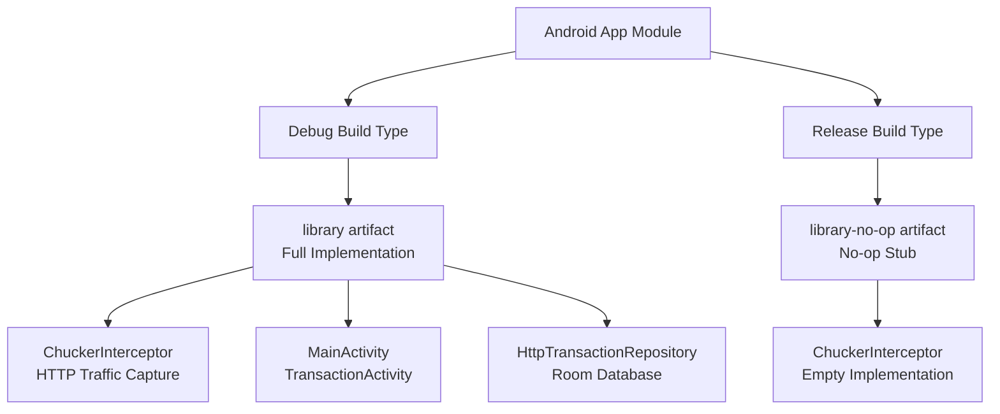
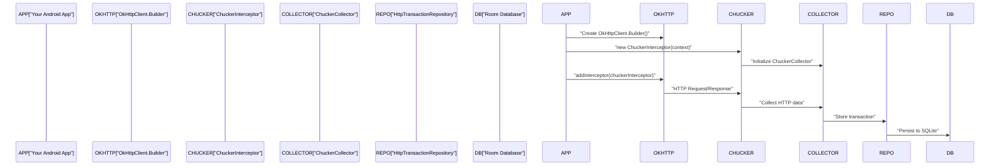
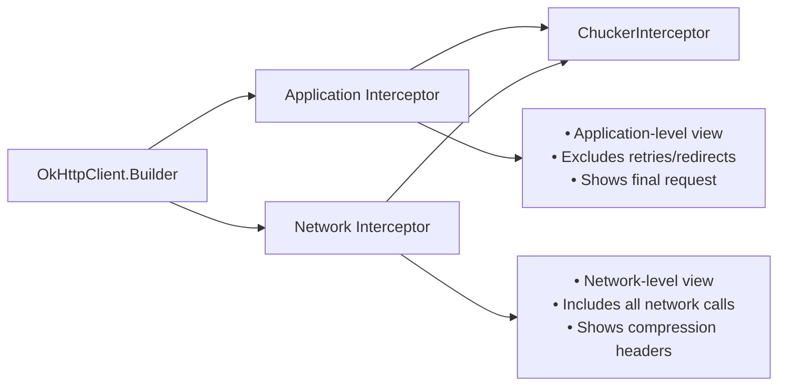

# Getting Started

<details>
<summary>Relevant source files</summary>

The following files were used as context for generating this wiki page:

- [CHANGELOG.md](CHANGELOG.md)
- [README.md](README.md)
- [build.gradle](build.gradle)
- [gradle.properties](gradle.properties)
- [gradle/wrapper/gradle-wrapper.properties](gradle/wrapper/gradle-wrapper.properties)
- [library-no-op/build.gradle](library-no-op/build.gradle)
- [library/build.gradle](library/build.gradle)
- [library/src/main/kotlin/com/chuckerteam/chucker/internal/ui/BaseChuckerActivity.kt](library/src/main/kotlin/com/chuckerteam/chucker/internal/ui/BaseChuckerActivity.kt)
- [sample/build.gradle](sample/build.gradle)
- [sample/src/main/kotlin/com/chuckerteam/chucker/sample/MainActivity.kt](sample/src/main/kotlin/com/chuckerteam/chucker/sample/MainActivity.kt)

</details>


This document provides a complete guide for integrating Chucker into Android projects. It covers dependency setup, basic configuration, and verification steps to get HTTP inspection working in your application.

Chucker is designed to be used during development only, with an automatic no-op implementation for release builds. For information about build system configuration and publishing, see [Build System](#3). For detailed API documentation, see [Core API](#4).

## Prerequisites

Before integrating Chucker, ensure your Android project meets these requirements:

| Requirement | Version | Notes |
|-------------|---------|-------|
| Android API Level | 21+ | Minimum SDK version |
| OkHttp | 4.x | Required for interceptor integration |
| Java | 8+ | Language level compatibility |
| Kotlin | 1.8+ (optional) | For Kotlin projects |
| Android Gradle Plugin | 7.0+ | Build system compatibility |

**Sources:** [build.gradle:113-116](), [library/build.gradle:18-21](), [README.md:76-77]()

## Dependency Configuration

### Dual-Variant Setup

Chucker uses a dual-artifact approach to ensure zero impact on release builds. Add both variants to your app module's `build.gradle`:

```gradle
dependencies {
  debugImplementation "com.github.chuckerteam.chucker:library:3.5.2"
  releaseImplementation "com.github.chuckerteam.chucker:library-no-op:3.5.2"
}
```

### Build Variant Resolution



The Gradle build system automatically selects the appropriate variant based on your build configuration. Debug builds get full HTTP inspection capabilities, while release builds get an empty stub with zero overhead.

**Sources:** [README.md:36-42](), [sample/build.gradle:70-71](), [library-no-op/build.gradle:44-45]()

### Java 8 Language Features

Enable Java 8 support in your module's `build.gradle`:

```gradle
android {
  compileOptions {
    sourceCompatibility JavaVersion.VERSION_1_8
    targetCompatibility JavaVersion.VERSION_1_8
  }
  
  // For Kotlin projects
  kotlinOptions.jvmTarget = "1.8"
}
```

**Sources:** [README.md:55-64](), [library/build.gradle:50-53]()

## Basic Integration

### OkHttp Client Configuration

Integrate Chucker by adding `ChuckerInterceptor` to your OkHttp client:

```kotlin
val client = OkHttpClient.Builder()
    .addInterceptor(ChuckerInterceptor(context))
    .build()
```

### Integration Flow Diagram



**Sources:** [README.md:47-51](), [sample/src/main/kotlin/com/chuckerteam/chucker/sample/MainActivity.kt:18-20]()

## Advanced Configuration

### ChuckerCollector Customization

For advanced use cases, create a custom `ChuckerCollector` with specific retention and notification settings:

```kotlin
// Create the Collector
val chuckerCollector = ChuckerCollector(
    context = this,
    showNotification = true,
    retentionPeriod = RetentionManager.Period.ONE_HOUR
)

// Create the Interceptor
val chuckerInterceptor = ChuckerInterceptor.Builder(context)
    .collector(chuckerCollector)
    .maxContentLength(250_000L)
    .redactHeaders("Auth-Token", "Bearer")
    .alwaysReadResponseBody(true)
    .build()
```

### Configuration Options

| Option | Type | Description | Default |
|--------|------|-------------|---------|
| `showNotification` | Boolean | Display persistent notification | `true` |
| `retentionPeriod` | Period | How long to keep transaction data | `ONE_WEEK` |
| `maxContentLength` | Long | Maximum body size before truncation | `250,000` bytes |
| `redactHeaders` | String[] | Headers to mask in UI | `[]` |
| `alwaysReadResponseBody` | Boolean | Read body even if client doesn't consume | `false` |

**Sources:** [README.md:94-128]()

### Interceptor Type Selection



Choose between application and network interceptor based on your debugging needs. Application interceptors show the final request as your app sends it, while network interceptors capture all network-level details including retries and compression.

**Sources:** [sample/src/main/kotlin/com/chuckerteam/chucker/sample/MainActivity.kt:46-55](), [README.md:206-210]()

## Verification

### Runtime Verification

After integration, verify Chucker is working:

1. **Notification Check**: A persistent notification should appear showing HTTP activity
2. **UI Launch**: Tap the notification to open the transaction list
3. **Direct Launch**: Use `Chucker.getLaunchIntent(context)` to open UI programmatically

### Sample Integration

The sample app demonstrates complete integration patterns:

```kotlin
class MainActivity : AppCompatActivity() {
    private val client by lazy {
        createOkHttpClient(applicationContext, interceptorTypeSelector)
    }
    
    private fun launchChuckerDirectly() {
        startActivity(Chucker.getLaunchIntent(this))
    }
}
```

**Sources:** [sample/src/main/kotlin/com/chuckerteam/chucker/sample/MainActivity.kt:76-79]()

### Build Verification

Ensure both variants are properly configured by checking build outputs:

- **Debug builds**: Should include full Chucker UI and data collection
- **Release builds**: Should contain only no-op stubs with zero overhead
- **APK size**: Release builds should show no size increase from Chucker

**Sources:** [README.md:80](), [library-no-op/build.gradle:1-46]()
