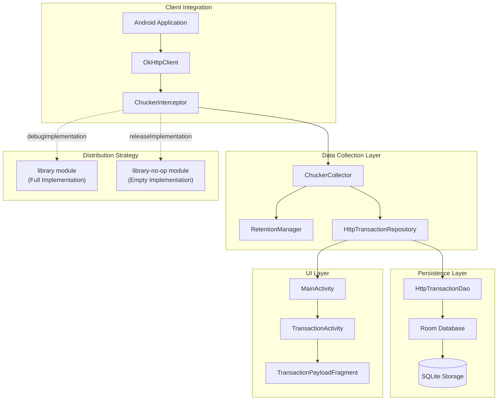
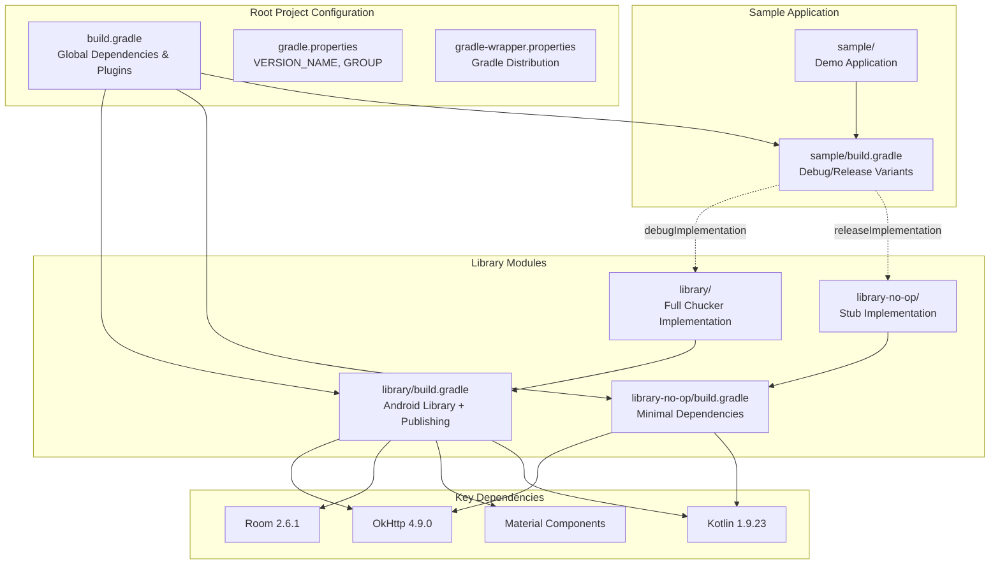
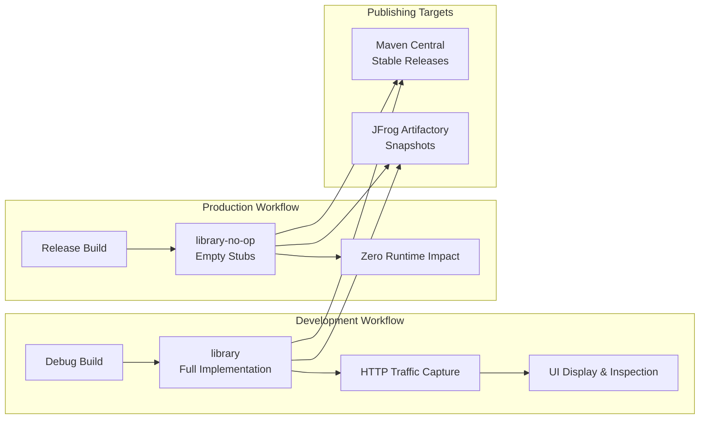

# Overview

Relevant source files

The following files were used as context for generating this wiki page:

- [CHANGELOG.md](CHANGELOG.md)
- [README.md](README.md)
- [build.gradle](build.gradle)
- [gradle.properties](gradle.properties)
- [gradle/wrapper/gradle-wrapper.properties](gradle/wrapper/gradle-wrapper.properties)
- [library-no-op/build.gradle](library-no-op/build.gradle)
- [library/build.gradle](library/build.gradle)
- [library/src/main/kotlin/com/chuckerteam/chucker/internal/ui/BaseChuckerActivity.kt](library/src/main/kotlin/com/chuckerteam/chucker/internal/ui/BaseChuckerActivity.kt)
- [sample/build.gradle](sample/build.gradle)
- [sample/src/main/kotlin/com/chuckerteam/chucker/sample/MainActivity.kt](sample/src/main/kotlin/com/chuckerteam/chucker/sample/MainActivity.kt)

## Purpose and Scope

This document provides a high-level overview of Chucker, an HTTP inspection library for Android applications. Chucker simplifies the debugging process by intercepting and persisting HTTP(S) requests/responses fired by Android applications, providing a comprehensive UI for inspecting network traffic during development.

This overview covers the core architecture, key components, module structure, and distribution strategy. For detailed integration instructions, see [Getting Started](#2). For build system specifics, see [Build System](#3). For UI component details, see [User Interface](#5).

## System Architecture

Chucker implements a multi-layered architecture that intercepts HTTP traffic through OkHttp and provides both data persistence and user interface capabilities.

### Core Architecture Flow

Sources: [README.md:24-51](), [library/src/main/kotlin/com/chuckerteam/chucker/internal/ui/BaseChuckerActivity.kt:15-20]()

### Module Structure and Dependencies

Sources: [build.gradle:1-118](), [library/build.gradle:1-157](), [library-no-op/build.gradle:1-109](), [sample/build.gradle:69-72]()

## Key Components

### ChuckerInterceptor
The primary entry point for developers, `ChuckerInterceptor` implements OkHttp's `Interceptor` interface to capture HTTP traffic. It can be configured with various options including header redaction, body size limits, and custom decoders.

### ChuckerCollector  
Manages data collection, retention policies, and notification visibility. The collector handles the lifecycle of HTTP transaction data and coordinates with the retention manager to clean up old transactions.

### HttpTransactionRepository
Provides the data access layer for HTTP transactions, abstracting database operations and providing a clean API for both the UI components and the interceptor to interact with stored transaction data.

### UI Components
- `MainActivity`: Displays the list of HTTP transactions
- `TransactionActivity`: Shows detailed request/response information
- `BaseChuckerActivity`: Common base class handling window insets and lifecycle

Sources: [README.md:45-51](), [README.md:95-128](), [library/src/main/kotlin/com/chuckerteam/chucker/internal/ui/BaseChuckerActivity.kt:15-72]()

## Distribution Strategy

Chucker employs a dual-artifact distribution strategy to ensure production safety:

| Artifact | Build Type | Implementation | Purpose |
|----------|------------|----------------|---------|
| `library` | `debugImplementation` | Full functionality | Development/debugging |
| `library-no-op` | `releaseImplementation` | Empty stubs | Production builds |

This approach ensures that Chucker code is completely absent from release builds while providing full functionality during development.

Sources: [README.md:36-43](), [library/build.gradle:107-156](), [library-no-op/build.gradle:59-108](), [sample/build.gradle:69-72]()

## Build and Publishing System

The project uses a sophisticated Gradle-based build system with automated publishing to multiple repositories:

### Version Management
- Version information stored in [gradle.properties:20-23]()
- Current version: `4.0.0-SNAPSHOT`
- Group ID: `com.github.chuckerteam.chucker` (updated to `com.meesho.android.chucker` in build files)

### Publishing Configuration
- **Snapshot builds**: Published to JFrog Artifactory on every `develop` branch push
- **Release builds**: Published to Maven Central via staging repositories  
- **Artifacts**: Both `library` and `library-no-op` variants with sources

### Development Requirements
- **Minimum SDK**: 21 (API level 21)
- **Target SDK**: 35 (API level 35) 
- **Kotlin**: 1.9.23
- **Java**: 17 (source/target compatibility)
- **OkHttp**: 4.9.0 minimum

Sources: [gradle.properties:20-31](), [build.gradle:113-116](), [library/build.gradle:17-25](), [CHANGELOG.md:212-214]()

## Integration Overview

Chucker integrates into Android projects through standard Gradle dependency declarations and minimal code changes. The typical integration requires adding both debug and release implementations, then configuring the `ChuckerInterceptor` with an existing `OkHttpClient`.

The library automatically handles data persistence, UI presentation, and notification management without requiring additional configuration from the developer.

Sources: [README.md:32-67](), [sample/src/main/kotlin/com/chuckerteam/chucker/sample/MainActivity.kt:17-20]()
