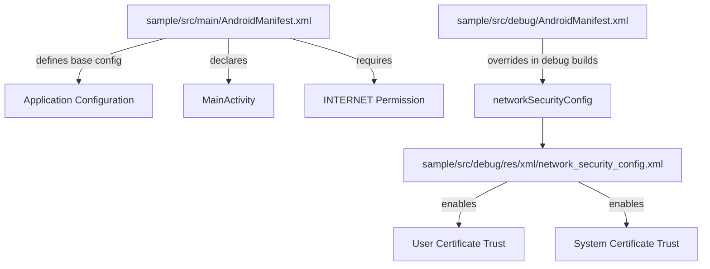
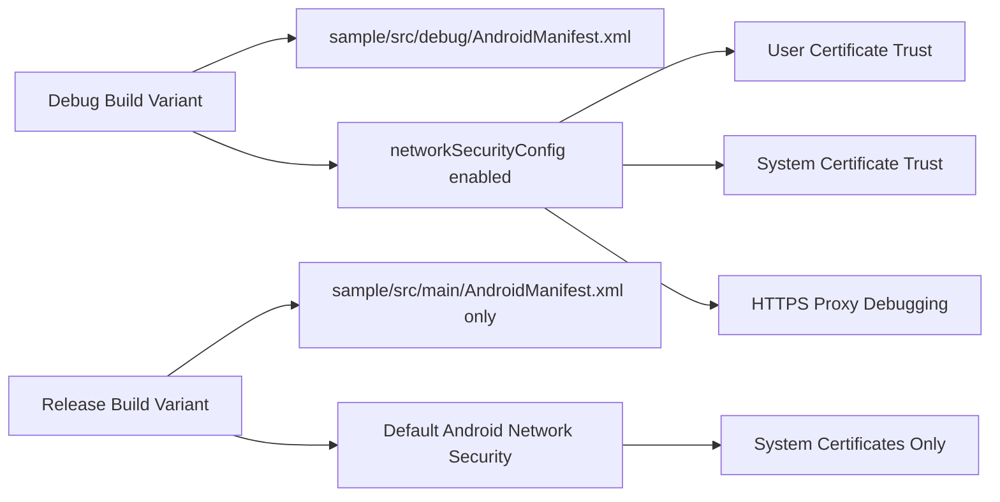

# Configuration and Manifest

<details>
<summary>Relevant source files</summary>

The following files were used as context for generating this wiki page:

- [library/src/main/res/menu/chucker_transaction.xml](library/src/main/res/menu/chucker_transaction.xml)
- [library/src/main/res/menu/chucker_transactions_list.xml](library/src/main/res/menu/chucker_transactions_list.xml)
- [sample/src/debug/AndroidManifest.xml](sample/src/debug/AndroidManifest.xml)
- [sample/src/debug/res/xml/network_security_config.xml](sample/src/debug/res/xml/network_security_config.xml)
- [sample/src/main/AndroidManifest.xml](sample/src/main/AndroidManifest.xml)

</details>


This page documents the Android manifest configuration and debug-specific settings for the Chucker sample application. It covers the standard manifest setup, debug build variant overrides, and network security configurations that enable proper HTTP inspection capabilities.

For information about the sample application's UI components and demonstration features, see [Sample UI and Features](#6.1). For details about the overall build system and module structure, see [Module Structure](#3.1).

## Purpose and Scope

The sample application demonstrates proper Chucker integration through its manifest configuration, particularly showcasing how debug and release builds can be configured differently to support HTTP inspection during development while maintaining production security standards.

## Main Manifest Configuration

The primary Android manifest defines the basic application structure and permissions required for HTTP inspection functionality.

### Application Structure

The main manifest [sample/src/main/AndroidManifest.xml:1-24]() establishes the core application configuration:

```xml
<manifest xmlns:android="http://schemas.android.com/apk/res/android"
    xmlns:tools="http://schemas.android.com/tools"
    package="com.chuckerteam.chucker.sample">

    <uses-permission android:name="android.permission.INTERNET" />

    <application
        android:icon="@mipmap/ic_launcher"
        android:label="@string/app_name"
        android:roundIcon="@mipmap/ic_launcher_round"
        android:theme="@style/AppTheme"
        tools:ignore="GoogleAppIndexingWarning">
```

### Activity Declaration

The sample application contains a single launcher activity [sample/src/main/AndroidManifest.xml:14-21]():

```xml
<activity
    android:name="com.chuckerteam.chucker.sample.MainActivity"
    android:exported="true">
    <intent-filter>
        <action android:name="android.intent.action.MAIN" />
        <category android:name="android.intent.category.LAUNCHER" />
    </intent-filter>
</activity>
```

The `MainActivity` serves as the entry point for demonstrating Chucker's HTTP inspection capabilities.

### Permissions

The manifest declares the `INTERNET` permission [sample/src/main/AndroidManifest.xml:6](), which is essential for:
- Making HTTP requests that will be intercepted by Chucker
- Allowing the ChuckerInterceptor to capture network traffic
- Enabling the sample app to demonstrate various HTTP scenarios

**Manifest Configuration Structure**


Sources: [sample/src/main/AndroidManifest.xml:1-24](), [sample/src/debug/AndroidManifest.xml:1-8](), [sample/src/debug/res/xml/network_security_config.xml:1-9]()

## Debug Build Variant Configuration

The debug build variant includes additional manifest configurations that override the main manifest to support enhanced debugging capabilities.

### Debug Manifest Override

The debug-specific manifest [sample/src/debug/AndroidManifest.xml:1-8]() provides build variant overrides:

```xml
<manifest xmlns:android="http://schemas.android.com/apk/res/android"
    xmlns:tools="http://schemas.android.com/tools">

    <application
        android:networkSecurityConfig="@xml/network_security_config"
        tools:targetApi="n" />
</manifest>
```

This configuration:
- Applies only to debug builds due to its location in the `src/debug` source set
- Overrides the application's network security policy
- Targets API level N (24) and above for network security config support

### Network Security Configuration

The network security configuration [sample/src/debug/res/xml/network_security_config.xml:1-9]() enables comprehensive certificate trust for debugging:

```xml
<network-security-config>
    <base-config>
        <trust-anchors>
            <certificates src="system"/>
            <certificates src="user"/>
        </trust-anchors>
    </base-config>
</network-security-config>
```

This configuration enables:
- **System certificates**: Standard CA certificates installed on the device
- **User certificates**: User-installed certificates, including proxy certificates for tools like Charles Proxy or mitmproxy

**Debug Configuration Flow**


Sources: [sample/src/debug/AndroidManifest.xml:5-7](), [sample/src/debug/res/xml/network_security_config.xml:2-8]()

## Security Implications

The configuration demonstrates the security trade-offs between debug and release builds:

### Debug Build Security Profile
- **User certificate trust**: Enables HTTPS interception tools
- **Expanded trust anchors**: Allows debugging with self-signed certificates
- **Development-focused**: Prioritizes debugging capabilities over security

### Release Build Security Profile
- **System certificates only**: Follows Android security best practices  
- **No network security config override**: Uses default Android network security
- **Production-ready**: Maintains standard certificate validation

## Integration with Chucker Library

The manifest configuration supports Chucker's HTTP inspection capabilities by:

1. **Internet Permission**: Enables network requests that Chucker can intercept
2. **Debug Network Config**: Allows HTTPS traffic inspection through proxy tools
3. **Build Variant Separation**: Ensures debug-only configurations don't affect release builds

This configuration pattern is recommended for applications integrating Chucker, where debug builds need enhanced network debugging capabilities while release builds maintain production security standards.

| Configuration Aspect | Debug Build | Release Build |
|----------------------|-------------|---------------|
| Network Security Config | Custom (`network_security_config.xml`) | Android Default |
| Certificate Trust | System + User | System Only |
| HTTPS Proxy Support | Enabled | Disabled |
| Debugging Capabilities | Full HTTP Inspection | Limited |

Sources: [sample/src/main/AndroidManifest.xml:1-24](), [sample/src/debug/AndroidManifest.xml:1-8](), [sample/src/debug/res/xml/network_security_config.xml:1-9]()
