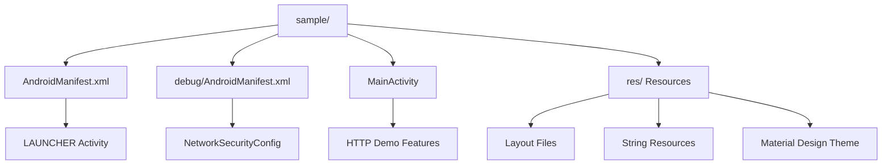
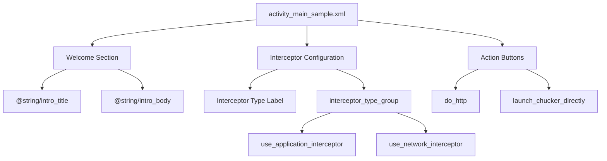
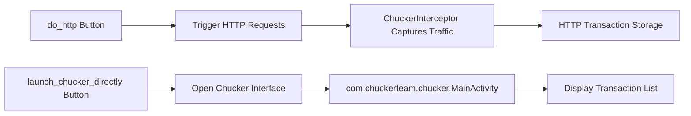
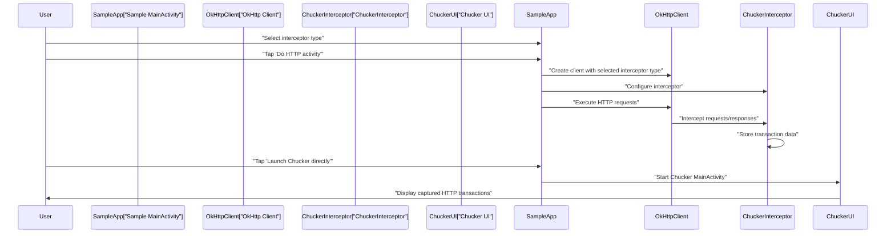

# Sample Application

<details>
<summary>Relevant source files</summary>

The following files were used as context for generating this wiki page:

- [library/src/main/res/menu/chucker_transaction.xml](library/src/main/res/menu/chucker_transaction.xml)
- [library/src/main/res/menu/chucker_transactions_list.xml](library/src/main/res/menu/chucker_transactions_list.xml)
- [sample/src/debug/AndroidManifest.xml](sample/src/debug/AndroidManifest.xml)
- [sample/src/debug/res/xml/network_security_config.xml](sample/src/debug/res/xml/network_security_config.xml)
- [sample/src/main/AndroidManifest.xml](sample/src/main/AndroidManifest.xml)
- [sample/src/main/res/layout/activity_main_sample.xml](sample/src/main/res/layout/activity_main_sample.xml)
- [sample/src/main/res/values/colors.xml](sample/src/main/res/values/colors.xml)
- [sample/src/main/res/values/dimens.xml](sample/src/main/res/values/dimens.xml)
- [sample/src/main/res/values/strings.xml](sample/src/main/res/values/strings.xml)
- [sample/src/main/res/values/styles.xml](sample/src/main/res/values/styles.xml)

</details>


This document covers the sample Android application included with Chucker that demonstrates the library's capabilities and serves as a practical integration example. The sample app shows how to configure Chucker interceptors, perform HTTP networking, and access the Chucker UI directly.

For information about the core Chucker API and interceptor configuration, see [Core API](#4). For details about the Chucker UI components, see [User Interface](#5).

## Purpose and Structure

The sample application is a standalone Android app located in the `sample/` module that demonstrates Chucker's HTTP inspection capabilities. It provides interactive examples of different interceptor configurations and allows developers to see Chucker in action with real HTTP requests.

### Application Configuration

The sample app is configured as a standard Android application with specific debug and release variants that showcase Chucker's dual-library approach.



Sources: [sample/src/main/AndroidManifest.xml:1-24](), [sample/src/debug/AndroidManifest.xml:1-8]()

### Dependencies and Build Configuration

The sample app demonstrates the recommended dependency configuration for using Chucker in development while excluding it from release builds.

| Build Variant | Dependency | Purpose |
|---------------|------------|---------|
| Debug | `debugImplementation` library | Full Chucker functionality for development |
| Release | `releaseImplementation` library-no-op | No-op stub for production builds |

This configuration ensures zero runtime overhead in production while providing full HTTP inspection capabilities during development.

Sources: Build system configuration referenced from overall architecture

## User Interface Components

The sample app's main interface demonstrates key Chucker integration patterns through an intuitive Material Design interface.



Sources: [sample/src/main/res/layout/activity_main_sample.xml:1-110]()

### Welcome Section

The app starts with an introductory section that explains its purpose to users:

- **Title**: "Welcome to Chucker Sample App" ([sample/src/main/res/values/strings.xml:9]())
- **Description**: Explains the app's purpose for HTTP networking demonstration ([sample/src/main/res/values/strings.xml:10]())

### Interceptor Configuration

A radio group allows users to choose between different OkHttp interceptor types:

- **Application Interceptor** (`use_application_interceptor`): Default selection for application-level HTTP interception
- **Network Interceptor** (`use_network_interceptor`): Network-level interception option

This demonstrates the difference between OkHttp's two interceptor types and their respective use cases with Chucker.

Sources: [sample/src/main/res/layout/activity_main_sample.xml:51-78](), [sample/src/main/res/values/strings.xml:3-5]()

### Action Buttons

Two primary action buttons demonstrate Chucker's main integration patterns:



Sources: [sample/src/main/res/layout/activity_main_sample.xml:80-101](), [sample/src/main/res/values/strings.xml:6-7]()

## Visual Design and Theming

The sample app uses Material Design components with a custom theme that demonstrates integration with existing app styling.

### Theme Configuration

The app applies a custom theme (`AppTheme`) based on Material Components:

- **Base Theme**: `Theme.MaterialComponents.DayNight.DarkActionBar`
- **Primary Color**: Deep blue (`#01579b`) for branding consistency
- **Primary Variant**: Darker blue (`#002f6c`) for emphasis

Sources: [sample/src/main/res/values/styles.xml:3-6](), [sample/src/main/res/values/colors.xml:3-4]()

### Layout Design

The main layout uses `ConstraintLayout` with Material Design guidelines:

- **Grid-based Spacing**: 8dp base grid with 16dp double spacing ([sample/src/main/res/values/dimens.xml:3-4]())
- **Maximum Width**: 500dp constraint for optimal readability on larger screens ([sample/src/main/res/values/dimens.xml:5]())
- **Material Components**: Uses `MaterialTextView`, `MaterialRadioButton`, and `MaterialButton` for consistent styling

Sources: [sample/src/main/res/layout/activity_main_sample.xml:2-110](), [sample/src/main/res/values/dimens.xml:1-6]()

## Debug Configuration

The sample app includes debug-specific configuration that demonstrates production-ready security practices.

### Network Security Configuration

In debug builds, the app includes a network security configuration that allows both system and user-added certificates:

```xml
<network-security-config>
    <base-config>
        <trust-anchors>
            <certificates src="system"/>
            <certificates src="user"/>
        </trust-anchors>
    </base-config>
</network-security-config>
```

This configuration enables testing with development servers and proxy tools like Charles or Burp Suite during debugging.

Sources: [sample/src/debug/res/xml/network_security_config.xml:1-9](), [sample/src/debug/AndroidManifest.xml:5-7]()

### Debug Manifest Override

The debug variant includes additional configuration through manifest merge:

- **Network Security Config**: Applied only in debug builds for development flexibility
- **Target API**: Explicitly targets Android N+ for network security features

Sources: [sample/src/debug/AndroidManifest.xml:1-8]()

## Integration Example Flow

The sample app demonstrates the complete integration workflow from setup to inspection:



This flow illustrates how the sample app bridges the gap between integration setup and practical usage, providing developers with a hands-on understanding of Chucker's capabilities.

Sources: Integration flow inferred from UI components and Chucker architecture
