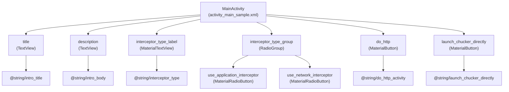
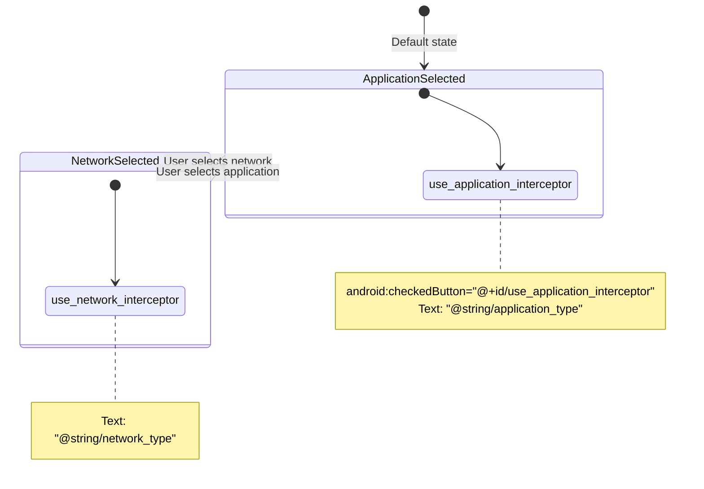
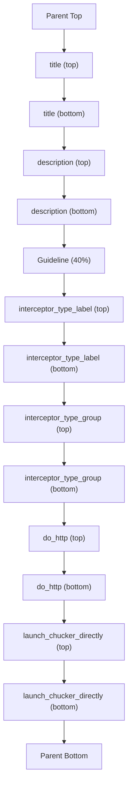

# Sample UI and Features

<details>
<summary>Relevant source files</summary>

The following files were used as context for generating this wiki page:

- [sample/src/main/res/layout/activity_main_sample.xml](sample/src/main/res/layout/activity_main_sample.xml)
- [sample/src/main/res/values/colors.xml](sample/src/main/res/values/colors.xml)
- [sample/src/main/res/values/dimens.xml](sample/src/main/res/values/dimens.xml)
- [sample/src/main/res/values/strings.xml](sample/src/main/res/values/strings.xml)
- [sample/src/main/res/values/styles.xml](sample/src/main/res/values/styles.xml)

</details>


This page documents the user interface components and demonstration features of the Chucker sample application. The sample app provides a simple interface for testing Chucker's HTTP inspection capabilities and demonstrates proper integration patterns.

For information about the sample app's configuration and manifest settings, see [Configuration and Manifest](#6.2). For details about Chucker's main UI components, see [User Interface](#5).

## UI Structure Overview

The sample application presents a clean, centered interface built with Material Design components. The main activity uses a constraint layout with vertically chained components to create an organized demonstration environment.

### Layout Architecture



**Sources:** [sample/src/main/res/layout/activity_main_sample.xml:1-111]()

### Component Hierarchy

The UI components are arranged in a vertical chain with the following structure:

| Component | Type | Purpose |
|-----------|------|---------|
| `title` | TextView | Displays welcome message |
| `description` | TextView | Explains sample app functionality |
| `interceptor_type_label` | MaterialTextView | Labels interceptor selection |
| `interceptor_type_group` | RadioGroup | Allows interceptor type selection |
| `do_http` | MaterialButton | Triggers HTTP demonstration |
| `launch_chucker_directly` | MaterialButton | Opens Chucker UI directly |

**Sources:** [sample/src/main/res/layout/activity_main_sample.xml:10-101]()

## Interactive Components

### Interceptor Type Selection

The sample app provides radio buttons to choose between OkHttp interceptor types, demonstrating how Chucker can be configured as either an application or network interceptor.



The `RadioGroup` component [sample/src/main/res/layout/activity_main_sample.xml:51-78]() contains two `MaterialRadioButton` elements with equal weight distribution and defaults to application interceptor selection.

**Sources:** [sample/src/main/res/layout/activity_main_sample.xml:51-78](), [sample/src/main/res/values/strings.xml:4-5]()

### Action Buttons

The sample app provides two primary actions:

#### Do HTTP Activity Button
- **ID:** `do_http`
- **Text:** "Do HTTP activity" 
- **Purpose:** Triggers network requests to demonstrate Chucker's interception capabilities

#### Launch Chucker Directly Button  
- **ID:** `launch_chucker_directly`
- **Text:** "Launch Chucker directly"
- **Purpose:** Opens the Chucker UI without requiring network activity

Both buttons use `MaterialButton` components with consistent sizing (`?attr/actionBarSize` height) and full-width constraints.

**Sources:** [sample/src/main/res/layout/activity_main_sample.xml:80-101](), [sample/src/main/res/values/strings.xml:6-7]()

## Material Design Theme

### Color Scheme

The sample app implements a custom Material Design theme with a blue color palette:

| Color Resource | Hex Value | Usage |
|----------------|-----------|--------|
| `chucker_sample_color_primary` | `#01579b` | Primary brand color |
| `chucker_sample_color_primary_variant` | `#002f6c` | Darker primary variant |

**Sources:** [sample/src/main/res/values/colors.xml:3-4]()

### Theme Configuration

The app uses `Theme.MaterialComponents.DayNight.DarkActionBar` as the base theme with custom color overrides:

```xml
<style name="AppTheme" parent="Theme.MaterialComponents.DayNight.DarkActionBar">
    <item name="colorPrimary">@color/chucker_sample_color_primary</item>
    <item name="colorPrimaryDark">@color/chucker_sample_color_primary_variant</item>
</style>
```

**Sources:** [sample/src/main/res/values/styles.xml:3-6]()

### Layout Dimensions

The sample app uses a consistent spacing system with standardized dimensions:

| Dimension | Value | Usage |
|-----------|-------|--------|
| `norm_grid_size` | 8dp | Base grid unit |
| `doub_grid_size` | 16dp | Double grid spacing |
| `max_width` | 500dp | Maximum component width |

These dimensions ensure consistent spacing and prevent components from becoming too wide on larger screens.

**Sources:** [sample/src/main/res/values/dimens.xml:3-5]()

## Content and Messaging

### Welcome Content

The app displays introductory content to help users understand the sample's purpose:

- **Title:** "Welcome to Chucker Sample App"
- **Description:** "You can use this sample app to do some HTTP networking and to see how Chucker can help you inspect your networking calls."

**Sources:** [sample/src/main/res/values/strings.xml:9-10]()

### Educational Elements

The interceptor type label includes an HTML link to OkHttp documentation, providing educational context about interceptor types:

```xml
<string name="interceptor_type">
    <a href="https://square.github.io/okhttp/interceptors/">Interceptor type</a>:
</string>
```

**Sources:** [sample/src/main/res/values/strings.xml:3]()

## UI Flow and Layout Constraints

The sample app uses `ConstraintLayout` with vertical chains and guidelines to create a responsive, centered design:



The layout uses a guideline at 40% of the screen height to separate the introductory content from the interactive controls, with vertical chain styling set to "packed" for optimal spacing.

**Sources:** [sample/src/main/res/layout/activity_main_sample.xml:18-22](), [sample/src/main/res/layout/activity_main_sample.xml:103-108]()
