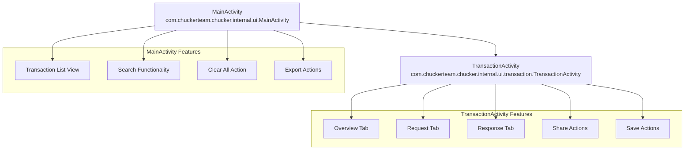
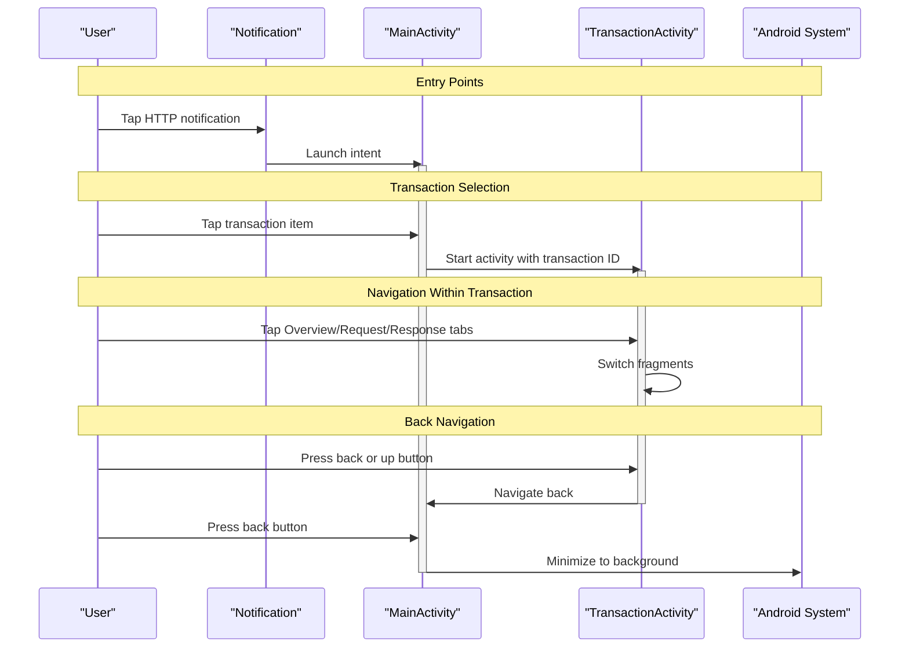
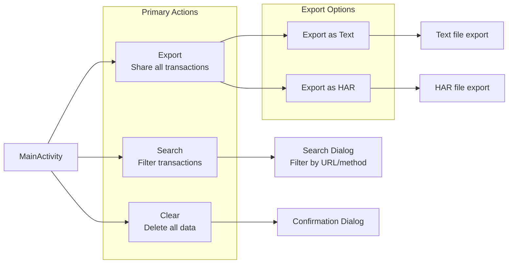

# Activities and Navigation

Relevant source files

The following files were used as context for generating this wiki page:

- [library/src/main/AndroidManifest.xml](library/src/main/AndroidManifest.xml)
- [library/src/main/res/values/strings.xml](library/src/main/res/values/strings.xml)

This document covers Chucker's Android activities and the navigation system that connects them. It focuses on the activity lifecycle, navigation patterns, intent handling, and how users move between different screens to inspect HTTP transactions.

For information about transaction display components and fragments, see [Transaction Display](#5.2). For theming and visual styling of these activities, see [Theming and Styling](#5.3).

## Activity Architecture

Chucker's UI consists of two primary activities that provide a hierarchical navigation experience for inspecting HTTP transactions.

### Activity Hierarchy

**Sources:** [library/src/main/AndroidManifest.xml:15-25](), [library/src/main/res/values/strings.xml:8-10](), [library/src/main/res/values/strings.xml:40-47]()

### Activity Configuration

Both activities are configured with specific Android manifest attributes that optimize their behavior for HTTP transaction inspection.

| Activity | Launch Mode | Task Affinity | Parent Activity |
|----------|-------------|---------------|-----------------|
| `MainActivity` | `singleTask` | `com.chuckerteam.chucker.task` | None |
| `TransactionActivity` | Default | Default | `MainActivity` |

The `MainActivity` uses `singleTask` launch mode to ensure only one instance exists, preventing multiple Chucker windows from cluttering the task stack. The custom task affinity `com.chuckerteam.chucker.task` isolates Chucker's activities in their own task separate from the host application.

**Sources:** [library/src/main/AndroidManifest.xml:18-19](), [library/src/main/AndroidManifest.xml:24]()

## Navigation Flow

The navigation system follows a master-detail pattern where users browse transactions in the main activity and drill down into specific transaction details.

### Navigation Sequence

**Sources:** [library/src/main/AndroidManifest.xml:15-25](), [library/src/main/res/values/strings.xml:3-4]()

### Deep Linking and Intent Handling

Chucker supports multiple entry points into its UI system:

1. **Notification Tap**: Users can tap the persistent HTTP recording notification to open `MainActivity`
2. **Direct Intent**: External apps can launch Chucker using explicit intents
3. **App Shortcuts**: Android app shortcuts provide quick access to the main interface

The activities handle standard Android navigation patterns including up navigation and back button behavior.

**Sources:** [library/src/main/AndroidManifest.xml:15-20](), [library/src/main/res/values/strings.xml:60]()

## Action Menu System

Both activities provide comprehensive action menus that enable transaction management and data export capabilities.

### MainActivity Actions

**Sources:** [library/src/main/res/values/strings.xml:5](), [library/src/main/res/values/strings.xml:27-28](), [library/src/main/res/values/strings.xml:40](), [library/src/main/res/values/strings.xml:48-50]()

### TransactionActivity Actions

The transaction detail activity provides granular sharing and export options for individual transactions:

| Action Category | Options | String Resources |
|----------------|---------|------------------|
| **Share** | Share as text, Share as cURL command, Share as file, Share as HAR | `chucker_share_as_text`, `chucker_share_as_curl`, `chucker_share_as_file`, `chucker_share_as_har` |
| **Save** | Save body to file | `chucker_save` |
| **View** | Show plain, Show highlighted, Expand, Collapse | `chucker_show_plain`, `chucker_highlight`, `chucker_expand`, `chucker_collapse` |

**Sources:** [library/src/main/res/values/strings.xml:30-34](), [library/src/main/res/values/strings.xml:61-64]()

## Task Management

Chucker's activities are designed to integrate seamlessly with Android's task management while maintaining isolation from the host application.

### Task Isolation Strategy

The custom task affinity `com.chuckerteam.chucker.task` ensures that Chucker activities run in a separate task stack. This provides several benefits:

- **Host App Independence**: Chucker's UI doesn't interfere with the host app's navigation stack
- **Memory Management**: The system can independently manage Chucker's task lifecycle
- **User Experience**: Users can switch between the host app and Chucker using the recent apps switcher

### Lifecycle Optimization

The `singleTask` launch mode for `MainActivity` prevents multiple instances and provides consistent entry point behavior. When launched while already running, the existing instance is brought to the foreground rather than creating a new one.

**Sources:** [library/src/main/AndroidManifest.xml:18-20]()

## Error Handling and Edge Cases

The navigation system handles several edge cases to ensure robust user experience:

- **Empty States**: When no transactions are recorded, MainActivity shows tutorial content
- **Search Results**: No matches found scenarios are handled with appropriate messaging
- **File Operations**: Export and save operations handle permission failures and storage errors
- **Network State**: Activities gracefully handle cases when transaction data is being recorded

**Sources:** [library/src/main/res/values/strings.xml:42](), [library/src/main/res/values/strings.xml:65](), [library/src/main/res/values/strings.xml:35-37]()
