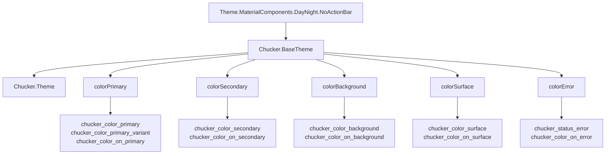
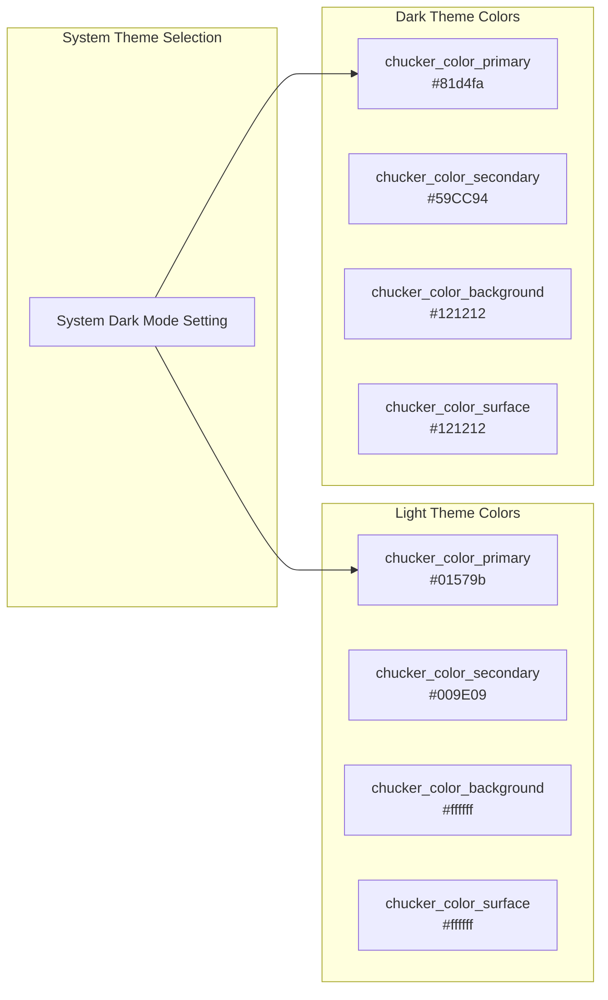
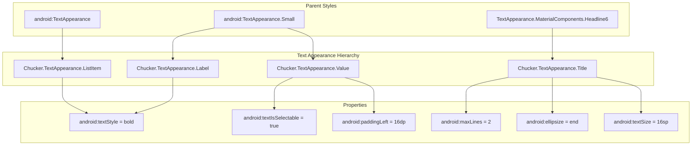
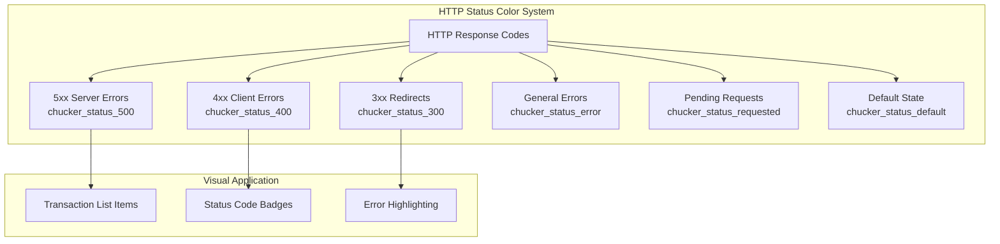
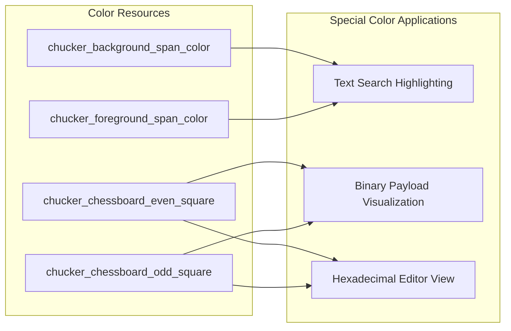

# Theming and Styling

Relevant source files

The following files were used as context for generating this wiki page:

- [library/src/main/res/layout/chucker_list_item_transaction.xml](library/src/main/res/layout/chucker_list_item_transaction.xml)
- [library/src/main/res/values-night/colors.xml](library/src/main/res/values-night/colors.xml)
- [library/src/main/res/values/colors.xml](library/src/main/res/values/colors.xml)
- [library/src/main/res/values/styles.xml](library/src/main/res/values/styles.xml)

This document covers Chucker's theming and styling system, including the Material Components-based theme architecture, color schemes for light and dark modes, typography definitions, and status-specific colors for HTTP response codes. The styling system ensures consistent visual presentation across all Chucker UI components while supporting system-wide dark mode switching.

For information about the UI components that use these themes, see [Activities and Navigation](#5.1) and [Transaction Display](#5.2).

## Theme Architecture

Chucker implements a Material Components DayNight theme that automatically switches between light and dark appearances based on system settings. The theme hierarchy is built around a base theme that defines all core Material Design color attributes.

### Base Theme Structure

The `Chucker.BaseTheme` defines the complete Material Design color palette with custom color resources, while `Chucker.Theme` serves as the application theme that inherits all base styling.

Sources: [library/src/main/res/values/styles.xml:4-18]()

## Color System

Chucker implements a comprehensive color system that provides distinct appearances for light and dark modes. Each mode defines its own color palette while maintaining semantic consistency.

### Light and Dark Mode Color Mapping

| Semantic Role | Light Theme | Dark Theme | Usage |
|---------------|-------------|------------|-------|
| Primary | `#01579b` (Dark Blue) | `#81d4fa` (Light Blue) | App bars, primary actions |
| Primary Variant | `#002f6c` (Darker Blue) | `#121212` (Dark Gray) | Status bars, variants |
| Secondary | `#009E09` (Green) | `#59CC94` (Light Green) | FABs, secondary actions |
| Background | `#ffffff` (White) | `#121212` (Dark Gray) | Screen backgrounds |
| Surface | `#ffffff` (White) | `#121212` (Dark Gray) | Card backgrounds |
| Error | `#F44336` (Red) | `#cf6679` (Pink Red) | Error states |

Sources: [library/src/main/res/values/colors.xml:3-13](), [library/src/main/res/values-night/colors.xml:3-13]()

## Typography and Text Appearances

Chucker defines specific text appearances for different UI contexts, ensuring consistent typography across the application. These styles are used throughout transaction lists, detail views, and payload displays.

### Text Appearance Definitions

### Typography Usage in Components

The transaction list item demonstrates how text appearances are applied to create visual hierarchy:

- **List Item Text**: Uses `Chucker.TextAppearance.ListItem` for HTTP status codes and request paths
- **Label Text**: Uses `Chucker.TextAppearance.Label` for field labels in detail views
- **Value Text**: Uses `Chucker.TextAppearance.Value` for selectable field values with padding
- **Title Text**: Uses `Chucker.TextAppearance.Title` for section headers with size and line constraints

Sources: [library/src/main/res/values/styles.xml:22-39](), [library/src/main/res/layout/chucker_list_item_transaction.xml:24-36]()

## HTTP Status Code Colors

Chucker provides semantic coloring for HTTP status codes, making it easy to quickly identify request outcomes. The color system includes specific colors for different status code ranges that adapt between light and dark themes.

### Status Color Definitions

| Status Category | Light Theme Color | Dark Theme Color | HTTP Codes |
|-----------------|-------------------|------------------|------------|
| Default | `#212121` (Dark Gray) | `#e0e0e0` (Light Gray) | General text |
| Requested | `#9E9E9E` (Gray) | `#757575` (Medium Gray) | Pending requests |
| Error | `#F44336` (Red) | `#e57373` (Light Red) | Error states |
| 5xx Server | `#B71C1C` (Dark Red) | `#e53935` (Red) | Server errors |
| 4xx Client | `#FF9800` (Orange) | `#ffb74d` (Light Orange) | Client errors |
| 3xx Redirect | `#0D47A1` (Blue) | `#64b5f6` (Light Blue) | Redirects |

Sources: [library/src/main/res/values/colors.xml:15-21](), [library/src/main/res/values-night/colors.xml:15-21]()

## Special Purpose Colors

Chucker includes additional color definitions for specific UI features such as text highlighting and chessboard patterns used in payload visualization.

### Highlighting and Pattern Colors

- **Background Span**: `chucker_background_span_color` - Yellow highlighting for light theme, yellow for dark theme
- **Foreground Span**: `chucker_foreground_span_color` - Red text for light theme, red for dark theme
- **Chessboard Pattern**: Alternating square colors for binary/hex payload visualization

The chessboard colors provide different values for light and dark themes to maintain readability:
- Light theme uses `#F8FAFC` and `#D2DADF` for subtle contrast
- Dark theme uses `#182531` and `#01101D` for appropriate dark mode contrast

Sources: [library/src/main/res/values/colors.xml:22-28](), [library/src/main/res/values-night/colors.xml:22-23]()

## Theme Integration

The styling system integrates with Android's configuration-based resource selection, automatically applying the correct theme variant based on system settings. The `DayNight` theme parent ensures seamless switching between light and dark modes without requiring application restarts.

All UI components reference theme attributes rather than hardcoded colors, ensuring consistent theming throughout the application. Layout files use style references like `@style/Chucker.TextAppearance.ListItem` and color references like `?android:attr/selectableItemBackground` to maintain theme consistency.

Sources: [library/src/main/res/values/styles.xml:4](), [library/src/main/res/layout/chucker_list_item_transaction.xml:8-24]()
