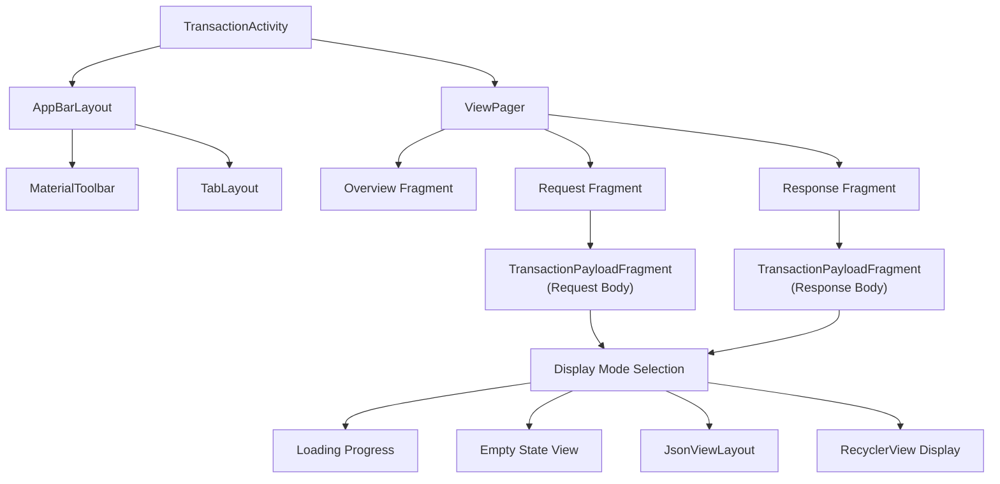
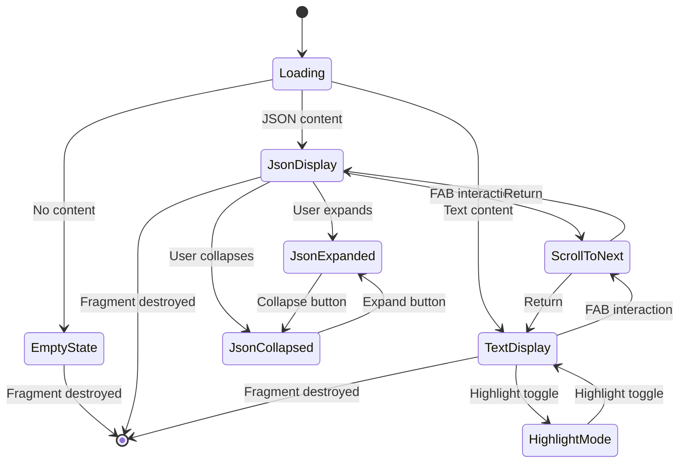
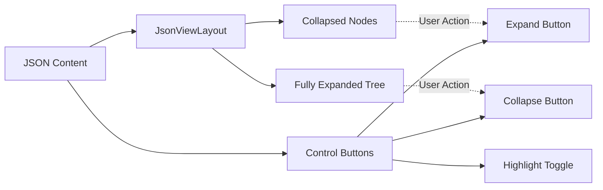

# Transaction Display

Relevant source files

The following files were used as context for generating this wiki page:

- [library/src/main/res/drawable/chucker_arrow_down.xml](library/src/main/res/drawable/chucker_arrow_down.xml)
- [library/src/main/res/layout/chucker_activity_transaction.xml](library/src/main/res/layout/chucker_activity_transaction.xml)
- [library/src/main/res/layout/chucker_fragment_transaction_payload.xml](library/src/main/res/layout/chucker_fragment_transaction_payload.xml)

This document covers how HTTP transaction data is presented and rendered within Chucker's user interface. It focuses specifically on the visual display components, payload rendering, and interactive features for examining transaction details.

For information about navigation between activities and overall UI flow, see [Activities and Navigation](#5.1). For theming and visual customization options, see [Theming and Styling](#5.3).

## Display Architecture Overview

The transaction display system uses a tabbed interface architecture built around Android's `ViewPager` and fragment-based content presentation.

Sources: [library/src/main/res/layout/chucker_activity_transaction.xml:1-44]()

## Transaction Activity Layout Structure

The main transaction display activity uses a coordinator layout with collapsing toolbar behavior and tab navigation.

| Component | Purpose | Layout Behavior |
|-----------|---------|-----------------|
| `CoordinatorLayout` | Root container with scrolling coordination | Full screen |
| `AppBarLayout` | Contains toolbar and tabs | Collapsible on scroll |
| `MaterialToolbar` | Custom title display and action menu | Fixed height |
| `TabLayout` | Navigation between Overview/Request/Response | Material design tabs |
| `ViewPager` | Fragment container with swipe navigation | Scrollable content area |

The toolbar includes a custom `TextView` for displaying transaction-specific titles rather than using the standard action bar title mechanism.

Sources: [library/src/main/res/layout/chucker_activity_transaction.xml:2-44]()

## Payload Fragment Display States

The `TransactionPayloadFragment` handles multiple display states based on content type and loading status.

### State Management Diagram

### Loading State
- Displays centered `ProgressBar` with indeterminate animation
- Visible during content processing and formatting
- All other views hidden during this state

### Empty State
- Shows custom empty payload icon and descriptive text
- Uses `ConstraintLayout.Group` to manage visibility of related views
- Displays when request/response body is null or empty

Sources: [library/src/main/res/layout/chucker_fragment_transaction_payload.xml:10-20,22-45,118-124]()

## Content Display Modes

### JSON Content Display

For JSON payloads, the fragment uses the `JsonViewLayout` component with expand/collapse functionality.

The JSON view is contained within a horizontal `LinearLayout` that includes:
- Highlight toggle button for syntax highlighting
- Expand button to open all JSON nodes  
- Collapse button to close all JSON nodes

Sources: [library/src/main/res/layout/chucker_fragment_transaction_payload.xml:48-88,91-99]()

### Text Content Display

For non-JSON text content, the fragment uses a `RecyclerView` with line-by-line display.

| Component | Configuration | Purpose |
|-----------|--------------|---------|
| `RecyclerView` | `LinearLayoutManager` | Line-by-line text rendering |
| `android:clipToPadding="false"` | Padding behavior | Smooth scroll experience |
| `android:scrollbars="vertical"` | Scrollbar display | Visual scroll indicator |
| `tools:listitem` | Preview layout | References `chucker_transaction_item_body_line` |

The RecyclerView supports vertical scrolling with padding that doesn't clip content, providing smooth scrolling for large text payloads.

Sources: [library/src/main/res/layout/chucker_fragment_transaction_payload.xml:102-116]()

## Interactive Navigation Features

### Floating Action Button

A `FloatingActionButton` provides search and navigation functionality within payload content.

- **Position**: Bottom-right corner with margin constraints
- **Icon**: Down arrow drawable (`chucker_arrow_down`)
- **Functionality**: "Find next occurrence" navigation
- **Visibility**: Dynamically shown/hidden based on content state

The FAB uses constraint layout positioning with bias settings to anchor to the bottom-right while maintaining responsive margins.

Sources: [library/src/main/res/layout/chucker_fragment_transaction_payload.xml:126-141](), [library/src/main/res/drawable/chucker_arrow_down.xml:1-7]()

### Visibility States Summary

| UI Element | Default State | Show When | Hide When |
|------------|---------------|-----------|-----------|
| `loadingProgress` | `visible` | Content loading | Content ready |
| `emptyStateGroup` | `gone` | No payload content | Content exists |
| `jsonView` | `gone` | JSON content type | Non-JSON content |
| `payloadRecyclerView` | `invisible` | Text content type | JSON or empty content |
| `scrollerFab` | `invisible` | Content scrollable | No scroll needed |
| Control buttons | `gone` | Content-specific visibility | Not applicable to content |

The fragment coordinates these visibility states to ensure only appropriate UI elements are shown for the current content type and state.

Sources: [library/src/main/res/layout/chucker_fragment_transaction_payload.xml:15-16,65-66,75-76,85-86,95,109,122,140]()
