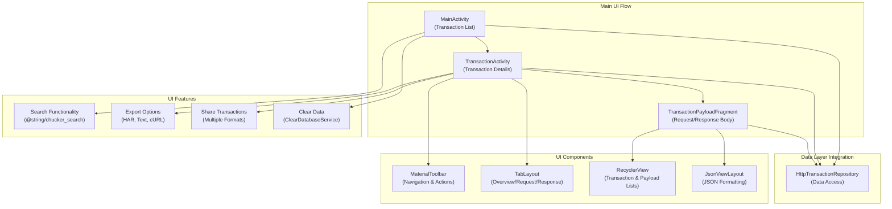
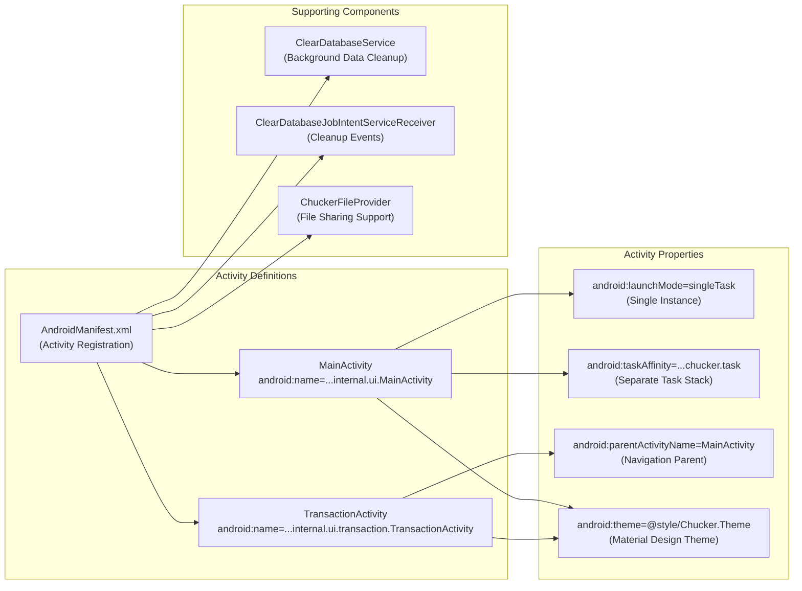
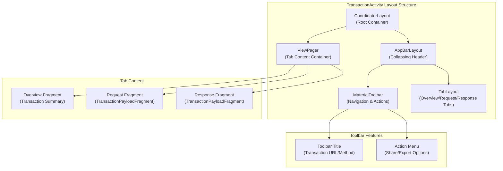
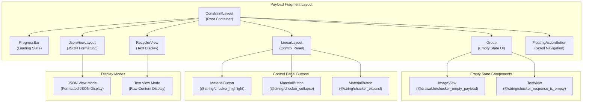
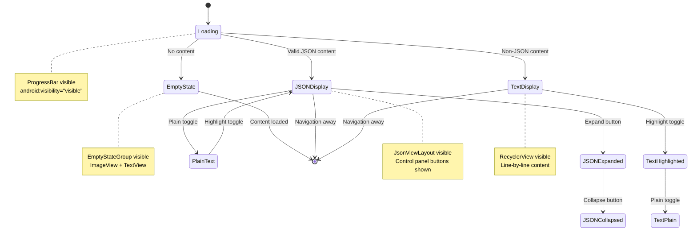
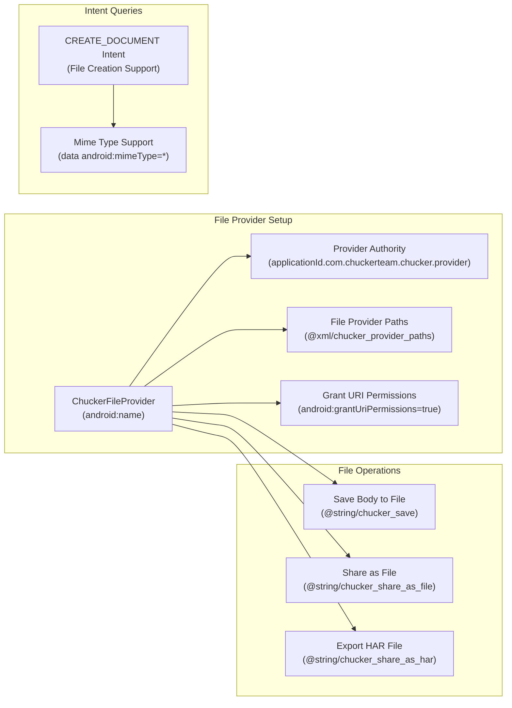

# User Interface

Relevant source files

The following files were used as context for generating this wiki page:

- [library/src/main/AndroidManifest.xml](library/src/main/AndroidManifest.xml)
- [library/src/main/res/drawable/chucker_arrow_down.xml](library/src/main/res/drawable/chucker_arrow_down.xml)
- [library/src/main/res/layout/chucker_activity_transaction.xml](library/src/main/res/layout/chucker_activity_transaction.xml)
- [library/src/main/res/layout/chucker_fragment_transaction_payload.xml](library/src/main/res/layout/chucker_fragment_transaction_payload.xml)
- [library/src/main/res/values/strings.xml](library/src/main/res/values/strings.xml)

This document covers Chucker's Android user interface components, activities, and user interactions. The UI provides a comprehensive inspection interface for HTTP transactions captured by the ChuckerInterceptor.

For information about the core API and data management that powers the UI, see [Core API](#4). For details about UI activities and navigation flow, see [Activities and Navigation](#5.1). For transaction display specifics, see [Transaction Display](#5.2). For theming and styling customization, see [Theming and Styling](#5.3).

## UI Architecture Overview

Chucker's user interface follows Android's Activity-based architecture with Material Design components. The UI consists of two main activities that display HTTP transaction data with comprehensive inspection capabilities.

Sources: [library/src/main/AndroidManifest.xml:15-25](), [library/src/main/res/layout/chucker_activity_transaction.xml:14-34](), [library/src/main/res/layout/chucker_fragment_transaction_payload.xml:91-116]()

## Core UI Activities

The UI is built around two primary activities defined in the Android manifest, each serving distinct inspection purposes.

Sources: [library/src/main/AndroidManifest.xml:15-44]()

## Transaction Detail Interface

The `TransactionActivity` provides a tabbed interface for comprehensive transaction inspection using Material Design components.

Sources: [library/src/main/res/layout/chucker_activity_transaction.xml:1-44]()

## Payload Display Components

The `TransactionPayloadFragment` handles request and response body display with multiple presentation modes and interactive features.

Sources: [library/src/main/res/layout/chucker_fragment_transaction_payload.xml:1-143]()

## UI Text Resources and Features

The strings resource file defines all user-facing text and reveals the comprehensive feature set available in the interface.

| Feature Category | String Keys | Functionality |
|------------------|-------------|---------------|
| **Core Navigation** | `chucker_name`, `chucker_overview`, `chucker_request`, `chucker_response` | Basic UI labels and navigation |
| **Transaction Data** | `chucker_url`, `chucker_method`, `chucker_protocol`, `chucker_status`, `chucker_ssl` | HTTP transaction field labels |
| **Timing Information** | `chucker_request_time`, `chucker_response_time`, `chucker_duration` | Performance metrics display |
| **Size Information** | `chucker_request_size`, `chucker_response_size`, `chucker_total_size` | Data size metrics |
| **Security Details** | `chucker_tls_version`, `chucker_tls_cipher_suite` | SSL/TLS security information |
| **Export Features** | `chucker_export`, `chucker_share_as_text`, `chucker_share_as_curl`, `chucker_share_as_har` | Multiple export format support |
| **File Operations** | `chucker_save`, `chucker_file_saved`, `chucker_file_not_saved` | File saving capabilities |
| **Search & Display** | `chucker_search`, `chucker_show_plain`, `chucker_highlight`, `chucker_expand`, `chucker_collapse` | Content inspection tools |
| **Data Management** | `chucker_clear`, `chucker_clear_http_confirmation` | Transaction history management |

Sources: [library/src/main/res/values/strings.xml:1-66]()

## Content Display States

The payload fragment implements multiple display states to handle different types of HTTP body content and user interactions.

Sources: [library/src/main/res/layout/chucker_fragment_transaction_payload.xml:10-125]()

## Notification System Integration

The UI integrates with Android's notification system to provide persistent access to HTTP inspection capabilities.

| String Resource | Purpose | Implementation |
|-----------------|---------|----------------|
| `chucker_http_notification_title` | "Recording HTTP activity" | Persistent notification title |
| `chucker_network_notification_category` | "Chucker network requests" | Notification channel categorization |
| `chucker_shortcut_label` | "Open Chucker" | App shortcut label for quick access |

Sources: [library/src/main/res/values/strings.xml:4](), [library/src/main/res/values/strings.xml:43](), [library/src/main/res/values/strings.xml:60]()

## File Provider Configuration

The UI supports file sharing through a custom `FileProvider` implementation that enables secure sharing of transaction data and exported files.

Sources: [library/src/main/AndroidManifest.xml:5-44](), [library/src/main/res/values/strings.xml:34](), [library/src/main/res/values/strings.xml:32-33]()
